# DocuVector: AI-Powered Document Intelligence System

## Table of Contents
1. [Overview](#overview)
2. [Architecture](#architecture)
3. [System Components](#system-components)
   - [AI/ML Pipeline](#aiml-pipeline)
   - [Vector Database Integration](#vector-database-integration)
   - [AIOps and Monitoring](#aiops-and-monitoring)
   - [Security and Compliance](#security-and-compliance)
   - [Team Collaboration](#team-collaboration)
4. [Technologies Used](#technologies-used)
5. [Setup Instructions](#setup-instructions)
6. [Development Guide](#development-guide)
7. [Deployment](#deployment)
8. [Monitoring and Maintenance](#monitoring-and-maintenance)
9. [Contributing](#contributing)
10. [License](#license)

## Overview
DocuVector is an advanced document intelligence system that leverages Generative AI and Vector Databases to provide intelligent document processing, search, and analysis capabilities. The system is built with a focus on scalability, security, and operational excellence.

## Architecture

### High-Level Architecture
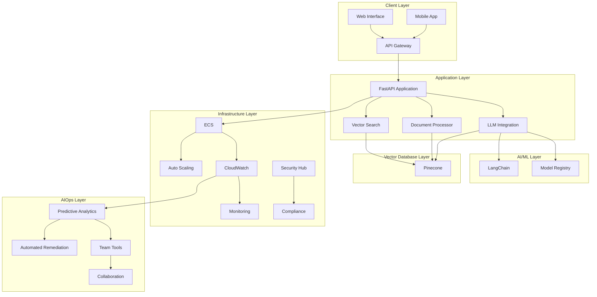
```mermaid
graph TD
    subgraph "Client Layer"
        A[Web Interface] --> B[API Gateway]
        C[Mobile App] --> B
    end

    subgraph "Application Layer"
        B --> D[FastAPI Application]
        D --> E[Document Processor]
        D --> F[LLM Integration]
        D --> G[Vector Search]
    end

    subgraph "AI/ML Layer"
        F --> H[LangChain]
        F --> I[Model Registry]
    end

    subgraph "Vector Database Layer"
        G --> J[Pinecone]
    end

    subgraph "Infrastructure Layer"
        K[ECS] --> L[Auto Scaling]
        M[CloudWatch] --> N[Monitoring]
        O[Security Hub] --> P[Compliance]
    end

    subgraph "AIOps Layer"
        Q[Predictive Analytics] --> R[Automated Remediation]
        S[Team Tools] --> T[Collaboration]
    end

    E --> J
    F --> J
    D --> K
    K --> M
    M --> Q
    Q --> S
```

### Detailed Component Diagrams

#### 1. AI/ML Pipeline Components

##### LangChain Integration
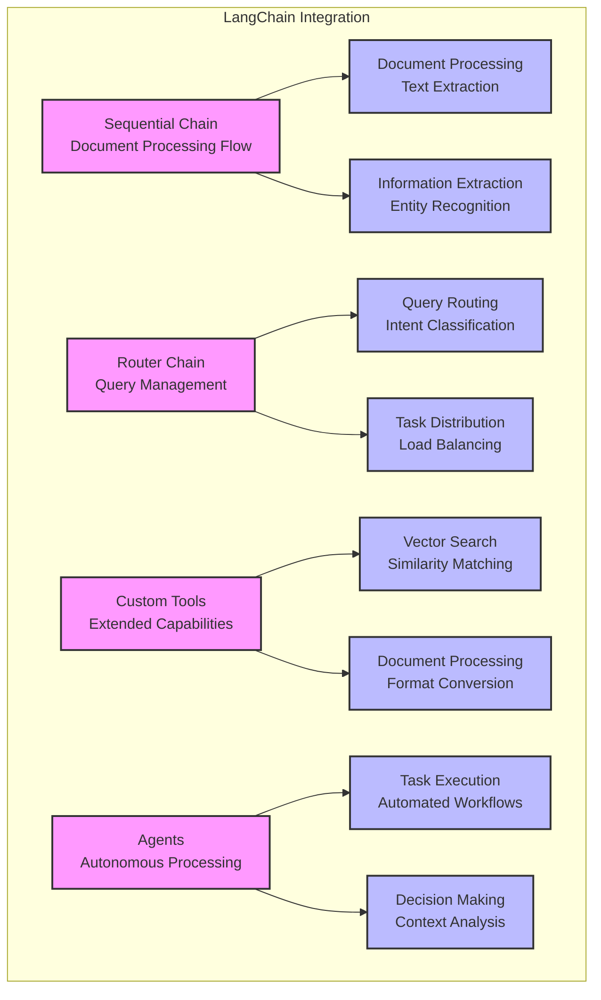
```mermaid
graph TD
    style A fill:#f9f,stroke:#333,stroke-width:2px
    style B fill:#bbf,stroke:#333,stroke-width:2px
    style C fill:#bbf,stroke:#333,stroke-width:2px
    style D fill:#f9f,stroke:#333,stroke-width:2px
    style E fill:#bbf,stroke:#333,stroke-width:2px
    style F fill:#bbf,stroke:#333,stroke-width:2px
    style G fill:#f9f,stroke:#333,stroke-width:2px
    style H fill:#bbf,stroke:#333,stroke-width:2px
    style I fill:#bbf,stroke:#333,stroke-width:2px
    style J fill:#f9f,stroke:#333,stroke-width:2px
    style K fill:#bbf,stroke:#333,stroke-width:2px
    style L fill:#bbf,stroke:#333,stroke-width:2px

    subgraph "LangChain Integration"
        A[Sequential Chain<br/>Document Processing Flow] --> B[Document Processing<br/>Text Extraction]
        A --> C[Information Extraction<br/>Entity Recognition]
        D[Router Chain<br/>Query Management] --> E[Query Routing<br/>Intent Classification]
        D --> F[Task Distribution<br/>Load Balancing]
        G[Custom Tools<br/>Extended Capabilities] --> H[Vector Search<br/>Similarity Matching]
        G --> I[Document Processing<br/>Format Conversion]
        J[Agents<br/>Autonomous Processing] --> K[Task Execution<br/>Automated Workflows]
        J --> L[Decision Making<br/>Context Analysis]
    end
```

The LangChain Integration layer handles document processing, query routing, and autonomous decision-making through a combination of sequential and router chains, custom tools, and intelligent agents.

##### Model Management
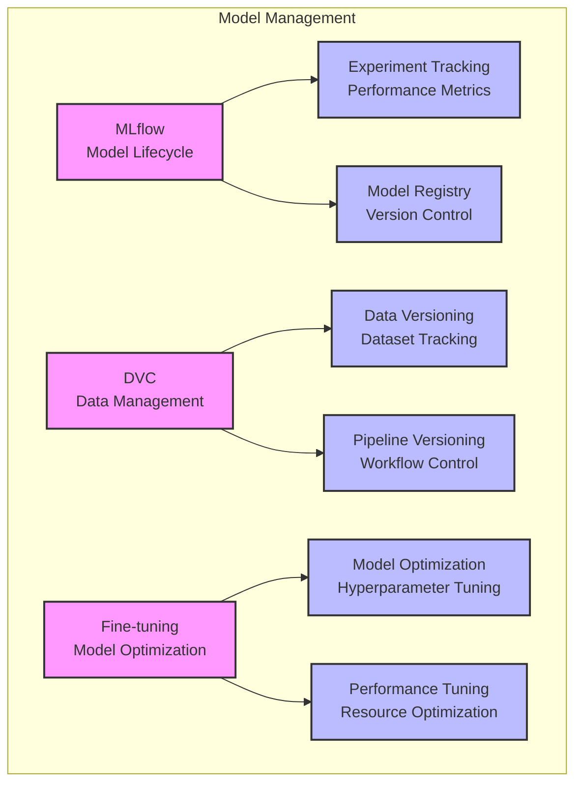
```mermaid
graph TD
    style M fill:#f9f,stroke:#333,stroke-width:2px
    style N fill:#bbf,stroke:#333,stroke-width:2px
    style O fill:#bbf,stroke:#333,stroke-width:2px
    style P fill:#f9f,stroke:#333,stroke-width:2px
    style Q fill:#bbf,stroke:#333,stroke-width:2px
    style R fill:#bbf,stroke:#333,stroke-width:2px
    style S fill:#f9f,stroke:#333,stroke-width:2px
    style T fill:#bbf,stroke:#333,stroke-width:2px
    style U fill:#bbf,stroke:#333,stroke-width:2px

    subgraph "Model Management"
        M[MLflow<br/>Model Lifecycle] --> N[Experiment Tracking<br/>Performance Metrics]
        M --> O[Model Registry<br/>Version Control]
        P[DVC<br/>Data Management] --> Q[Data Versioning<br/>Dataset Tracking]
        P --> R[Pipeline Versioning<br/>Workflow Control]
        S[Fine-tuning<br/>Model Optimization] --> T[Model Optimization<br/>Hyperparameter Tuning]
        S --> U[Performance Tuning<br/>Resource Optimization]
    end
```

The Model Management system provides comprehensive tracking and versioning of models, data, and pipelines, ensuring reproducibility and performance optimization.

##### Ethics & Governance
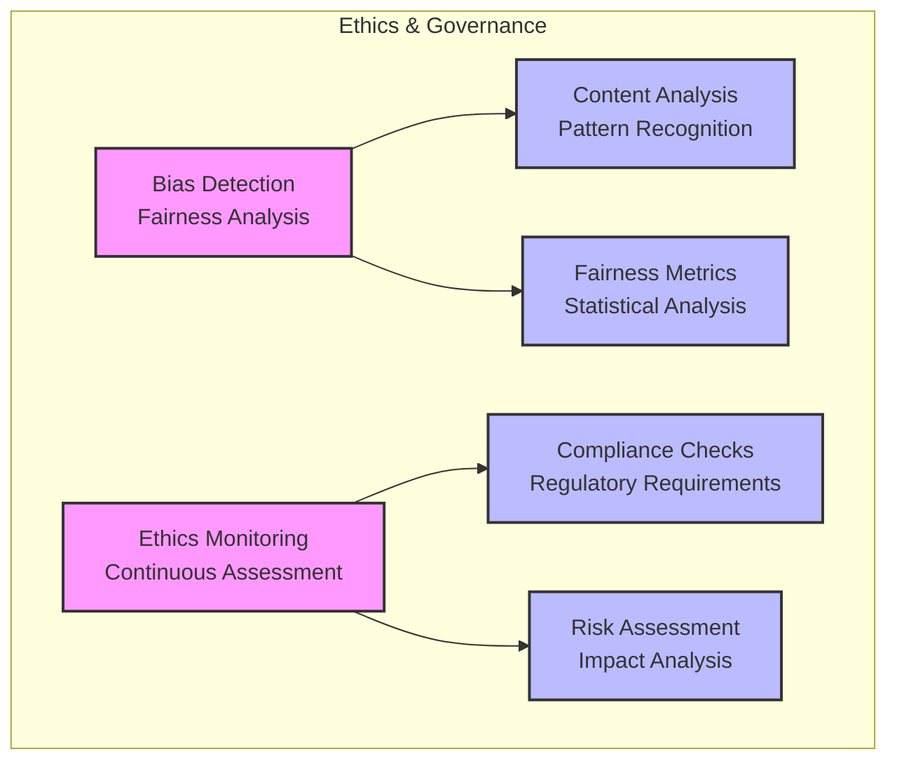
```mermaid
graph TD
    style V fill:#f9f,stroke:#333,stroke-width:2px
    style W fill:#bbf,stroke:#333,stroke-width:2px
    style X fill:#bbf,stroke:#333,stroke-width:2px
    style Y fill:#f9f,stroke:#333,stroke-width:2px
    style Z fill:#bbf,stroke:#333,stroke-width:2px
    style AA fill:#bbf,stroke:#333,stroke-width:2px

    subgraph "Ethics & Governance"
        V[Bias Detection<br/>Fairness Analysis] --> W[Content Analysis<br/>Pattern Recognition]
        V --> X[Fairness Metrics<br/>Statistical Analysis]
        Y[Ethics Monitoring<br/>Continuous Assessment] --> Z[Compliance Checks<br/>Regulatory Requirements]
        Y --> AA[Risk Assessment<br/>Impact Analysis]
    end
```

The Ethics & Governance framework ensures responsible AI deployment through continuous monitoring, bias detection, and compliance verification.

#### 2. Vector Database Components

##### Pinecone Configuration
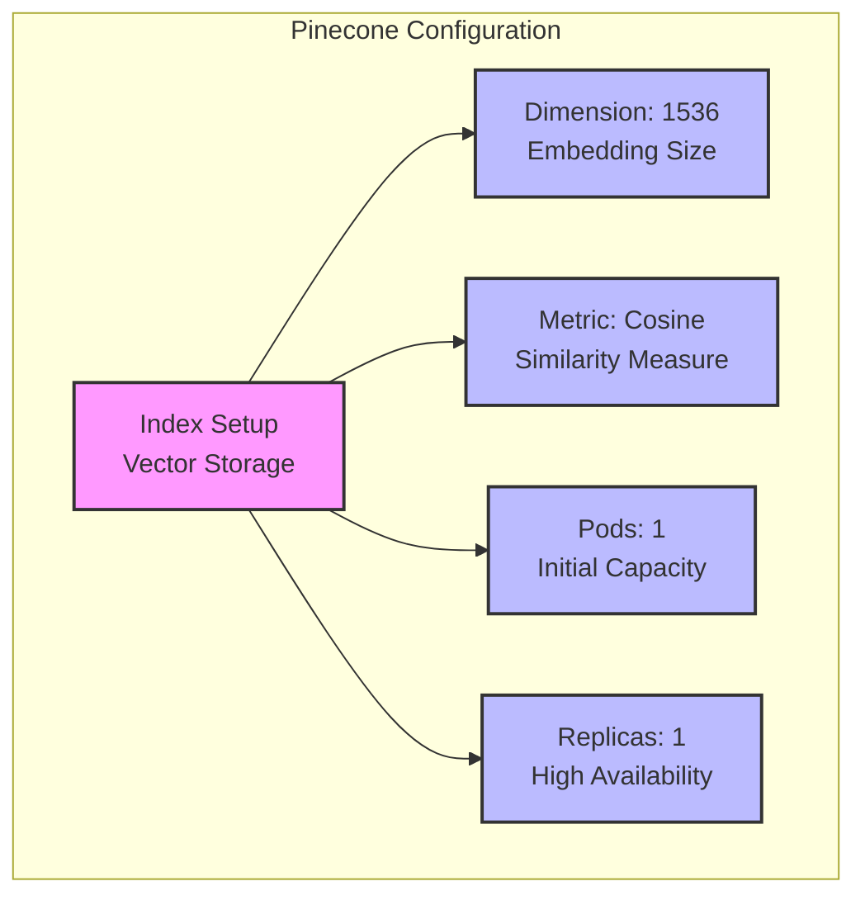
```mermaid
graph TD
    style A fill:#f9f,stroke:#333,stroke-width:2px
    style B fill:#bbf,stroke:#333,stroke-width:2px
    style C fill:#bbf,stroke:#333,stroke-width:2px
    style D fill:#bbf,stroke:#333,stroke-width:2px
    style E fill:#bbf,stroke:#333,stroke-width:2px

    subgraph "Pinecone Configuration"
        A[Index Setup<br/>Vector Storage] --> B[Dimension: 1536<br/>Embedding Size]
        A --> C[Metric: Cosine<br/>Similarity Measure]
        A --> D[Pods: 1<br/>Initial Capacity]
        A --> E[Replicas: 1<br/>High Availability]
    end
```

The Pinecone Configuration defines the vector database setup with optimized parameters for document embeddings and similarity search.

##### Scaling & Management
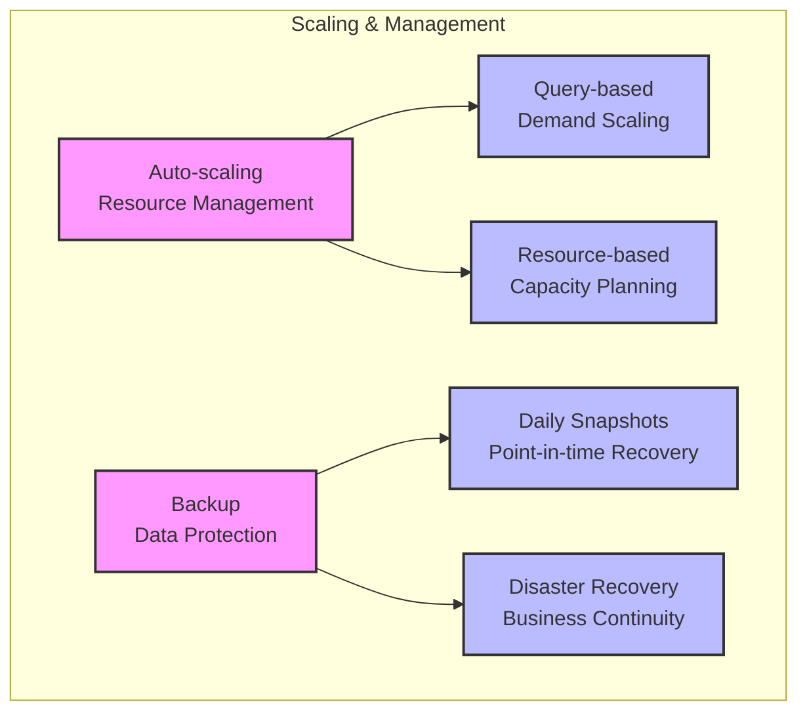
```mermaid
graph TD
    style F fill:#f9f,stroke:#333,stroke-width:2px
    style G fill:#bbf,stroke:#333,stroke-width:2px
    style H fill:#bbf,stroke:#333,stroke-width:2px
    style I fill:#f9f,stroke:#333,stroke-width:2px
    style J fill:#bbf,stroke:#333,stroke-width:2px
    style K fill:#bbf,stroke:#333,stroke-width:2px

    subgraph "Scaling & Management"
        F[Auto-scaling<br/>Resource Management] --> G[Query-based<br/>Demand Scaling]
        F --> H[Resource-based<br/>Capacity Planning]
        I[Backup<br/>Data Protection] --> J[Daily Snapshots<br/>Point-in-time Recovery]
        I --> K[Disaster Recovery<br/>Business Continuity]
    end
```

The Scaling & Management system ensures optimal resource utilization and data protection through automated scaling and backup strategies.

##### Security
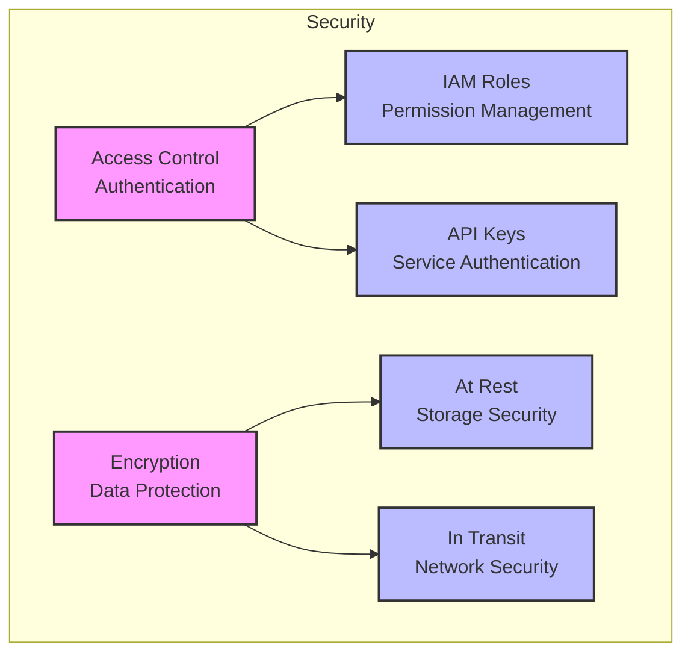
```mermaid
graph TD
    style L fill:#f9f,stroke:#333,stroke-width:2px
    style M fill:#bbf,stroke:#333,stroke-width:2px
    style N fill:#bbf,stroke:#333,stroke-width:2px
    style O fill:#f9f,stroke:#333,stroke-width:2px
    style P fill:#bbf,stroke:#333,stroke-width:2px
    style Q fill:#bbf,stroke:#333,stroke-width:2px

    subgraph "Security"
        L[Access Control<br/>Authentication] --> M[IAM Roles<br/>Permission Management]
        L --> N[API Keys<br/>Service Authentication]
        O[Encryption<br/>Data Protection] --> P[At Rest<br/>Storage Security]
        O --> Q[In Transit<br/>Network Security]
    end
```

The Security layer implements comprehensive access control and encryption mechanisms to protect sensitive data.

#### 3. AIOps Components

##### Predictive Analytics
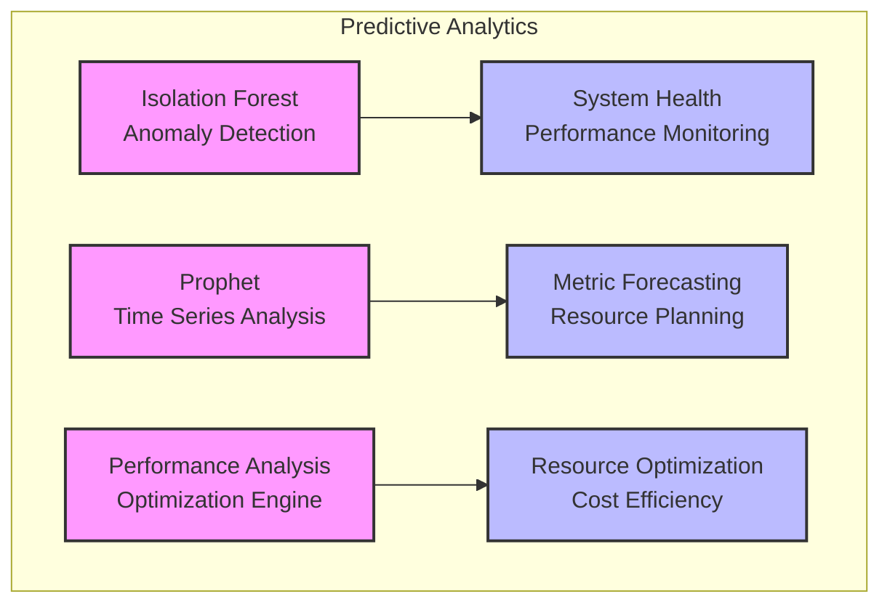
```mermaid
graph TD
    style A fill:#f9f,stroke:#333,stroke-width:2px
    style B fill:#bbf,stroke:#333,stroke-width:2px
    style C fill:#f9f,stroke:#333,stroke-width:2px
    style D fill:#bbf,stroke:#333,stroke-width:2px
    style E fill:#f9f,stroke:#333,stroke-width:2px
    style F fill:#bbf,stroke:#333,stroke-width:2px

    subgraph "Predictive Analytics"
        A[Isolation Forest<br/>Anomaly Detection] --> B[System Health<br/>Performance Monitoring]
        C[Prophet<br/>Time Series Analysis] --> D[Metric Forecasting<br/>Resource Planning]
        E[Performance Analysis<br/>Optimization Engine] --> F[Resource Optimization<br/>Cost Efficiency]
    end
```

The Predictive Analytics system leverages machine learning algorithms to detect anomalies, forecast system metrics, and optimize resource utilization for cost-effective operations.

##### Automated Remediation
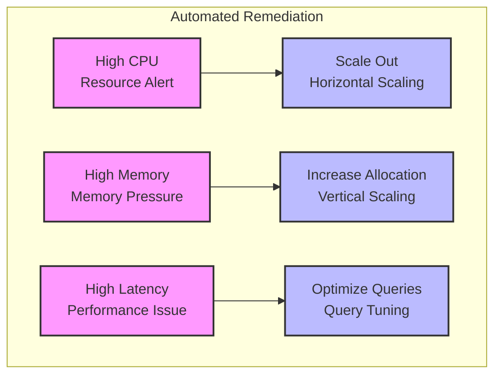
```mermaid
graph TD
    style G fill:#f9f,stroke:#333,stroke-width:2px
    style H fill:#bbf,stroke:#333,stroke-width:2px
    style I fill:#f9f,stroke:#333,stroke-width:2px
    style J fill:#bbf,stroke:#333,stroke-width:2px
    style K fill:#f9f,stroke:#333,stroke-width:2px
    style L fill:#bbf,stroke:#333,stroke-width:2px

    subgraph "Automated Remediation"
        G[High CPU<br/>Resource Alert] --> H[Scale Out<br/>Horizontal Scaling]
        I[High Memory<br/>Memory Pressure] --> J[Increase Allocation<br/>Vertical Scaling]
        K[High Latency<br/>Performance Issue] --> L[Optimize Queries<br/>Query Tuning]
    end
```

The Automated Remediation system provides self-healing capabilities by automatically responding to system alerts and implementing predefined remediation actions.

##### Monitoring
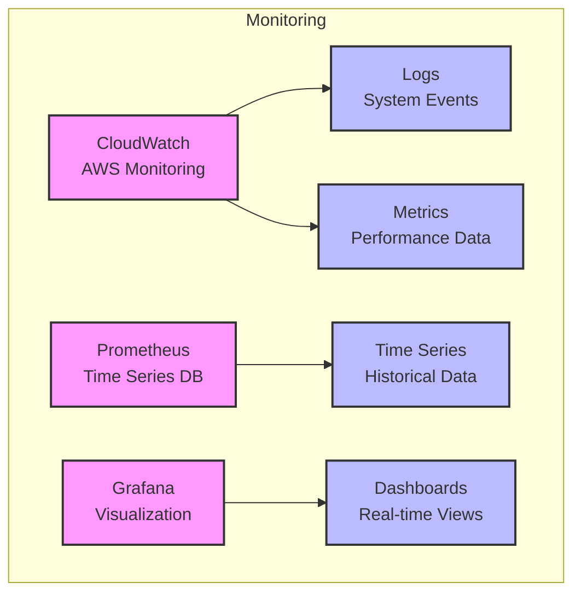
```mermaid
graph TD
    style M fill:#f9f,stroke:#333,stroke-width:2px
    style N fill:#bbf,stroke:#333,stroke-width:2px
    style O fill:#bbf,stroke:#333,stroke-width:2px
    style P fill:#f9f,stroke:#333,stroke-width:2px
    style Q fill:#bbf,stroke:#333,stroke-width:2px
    style R fill:#f9f,stroke:#333,stroke-width:2px
    style S fill:#bbf,stroke:#333,stroke-width:2px

    subgraph "Monitoring"
        M[CloudWatch<br/>AWS Monitoring] --> N[Logs<br/>System Events]
        M --> O[Metrics<br/>Performance Data]
        P[Prometheus<br/>Time Series DB] --> Q[Time Series<br/>Historical Data]
        R[Grafana<br/>Visualization] --> S[Dashboards<br/>Real-time Views]
    end
```

The Monitoring system provides comprehensive observability through log aggregation, metric collection, and real-time visualization of system performance.

#### 4. Security Components

##### Security Services
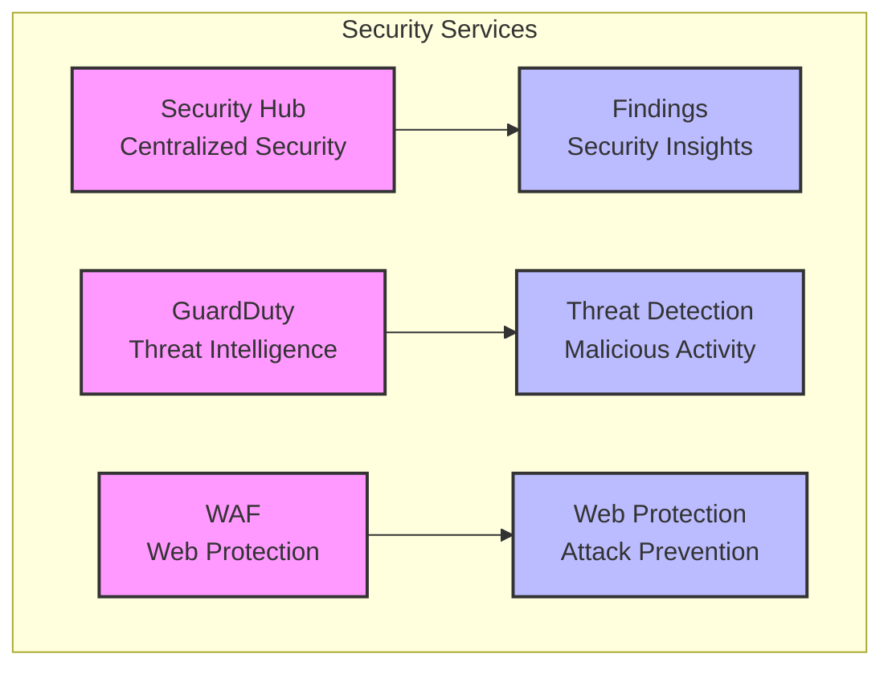
```mermaid
graph TD
    style A fill:#f9f,stroke:#333,stroke-width:2px
    style B fill:#bbf,stroke:#333,stroke-width:2px
    style C fill:#f9f,stroke:#333,stroke-width:2px
    style D fill:#bbf,stroke:#333,stroke-width:2px
    style E fill:#f9f,stroke:#333,stroke-width:2px
    style F fill:#bbf,stroke:#333,stroke-width:2px

    subgraph "Security Services"
        A[Security Hub<br/>Centralized Security] --> B[Findings<br/>Security Insights]
        C[GuardDuty<br/>Threat Intelligence] --> D[Threat Detection<br/>Malicious Activity]
        E[WAF<br/>Web Protection] --> F[Web Protection<br/>Attack Prevention]
    end
```

The Security Services layer provides comprehensive threat detection and prevention through centralized security management and real-time threat intelligence.

##### Compliance
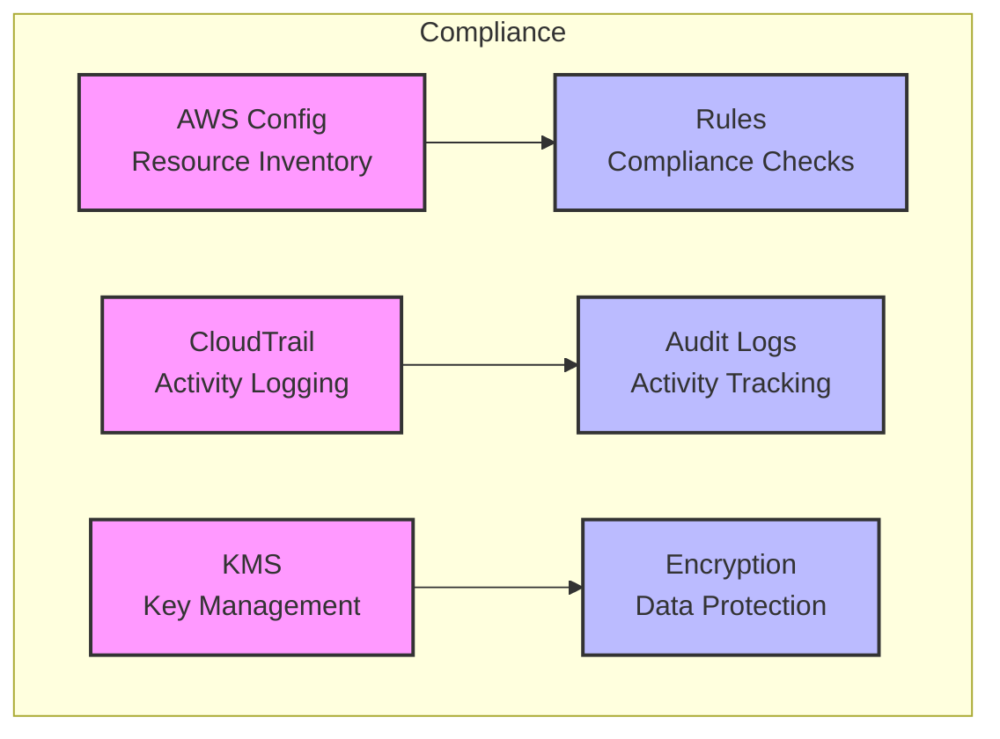
```mermaid
graph TD
    style G fill:#f9f,stroke:#333,stroke-width:2px
    style H fill:#bbf,stroke:#333,stroke-width:2px
    style I fill:#f9f,stroke:#333,stroke-width:2px
    style J fill:#bbf,stroke:#333,stroke-width:2px
    style K fill:#f9f,stroke:#333,stroke-width:2px
    style L fill:#bbf,stroke:#333,stroke-width:2px

    subgraph "Compliance"
        G[AWS Config<br/>Resource Inventory] --> H[Rules<br/>Compliance Checks]
        I[CloudTrail<br/>Activity Logging] --> J[Audit Logs<br/>Activity Tracking]
        K[KMS<br/>Key Management] --> L[Encryption<br/>Data Protection]
    end
```

The Compliance system ensures adherence to security standards through automated compliance checks, comprehensive audit logging, and robust encryption management.

##### Network Security
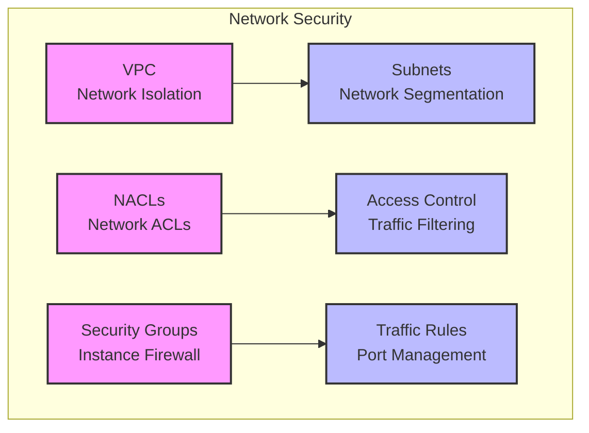
```mermaid
graph TD
    style M fill:#f9f,stroke:#333,stroke-width:2px
    style N fill:#bbf,stroke:#333,stroke-width:2px
    style O fill:#f9f,stroke:#333,stroke-width:2px
    style P fill:#bbf,stroke:#333,stroke-width:2px
    style Q fill:#f9f,stroke:#333,stroke-width:2px
    style R fill:#bbf,stroke:#333,stroke-width:2px

    subgraph "Network Security"
        M[VPC<br/>Network Isolation] --> N[Subnets<br/>Network Segmentation]
        O[NACLs<br/>Network ACLs] --> P[Access Control<br/>Traffic Filtering]
        Q[Security Groups<br/>Instance Firewall] --> R[Traffic Rules<br/>Port Management]
    end
```

The Network Security layer implements a defense-in-depth strategy through network isolation, traffic filtering, and instance-level security controls.

#### 5. Team Collaboration Components

##### Development Tools
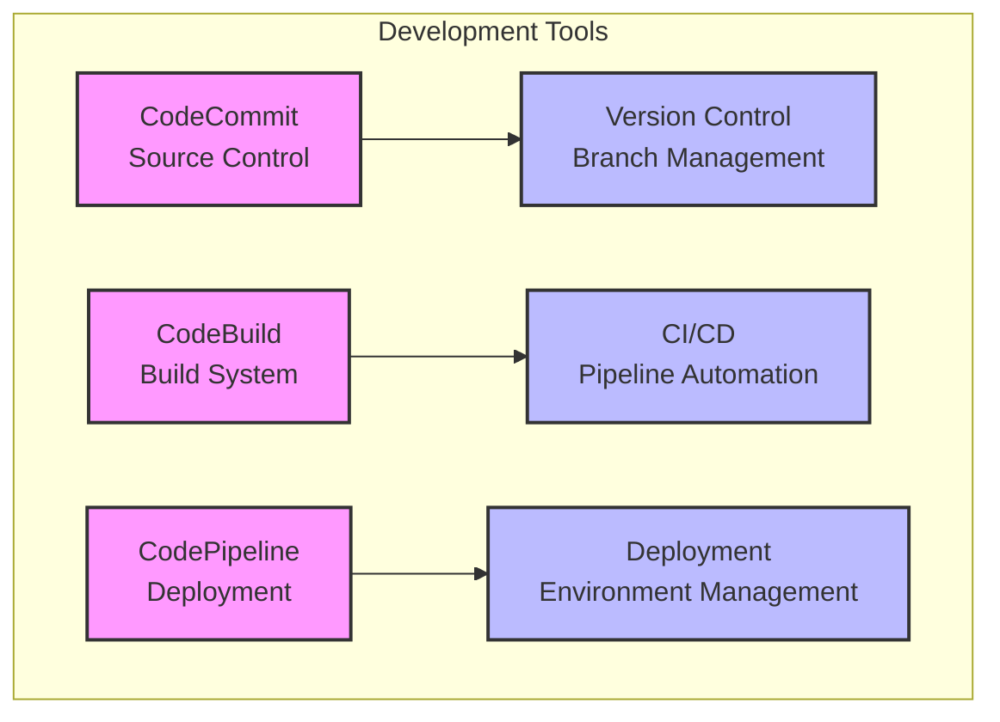
```mermaid
graph TD
    style A fill:#f9f,stroke:#333,stroke-width:2px
    style B fill:#bbf,stroke:#333,stroke-width:2px
    style C fill:#f9f,stroke:#333,stroke-width:2px
    style D fill:#bbf,stroke:#333,stroke-width:2px
    style E fill:#f9f,stroke:#333,stroke-width:2px
    style F fill:#bbf,stroke:#333,stroke-width:2px

    subgraph "Development Tools"
        A[CodeCommit<br/>Source Control] --> B[Version Control<br/>Branch Management]
        C[CodeBuild<br/>Build System] --> D[CI/CD<br/>Pipeline Automation]
        E[CodePipeline<br/>Deployment] --> F[Deployment<br/>Environment Management]
    end
```

The Development Tools system provides a comprehensive development workflow, from source control to deployment, ensuring consistent and automated software delivery.

##### Collaboration
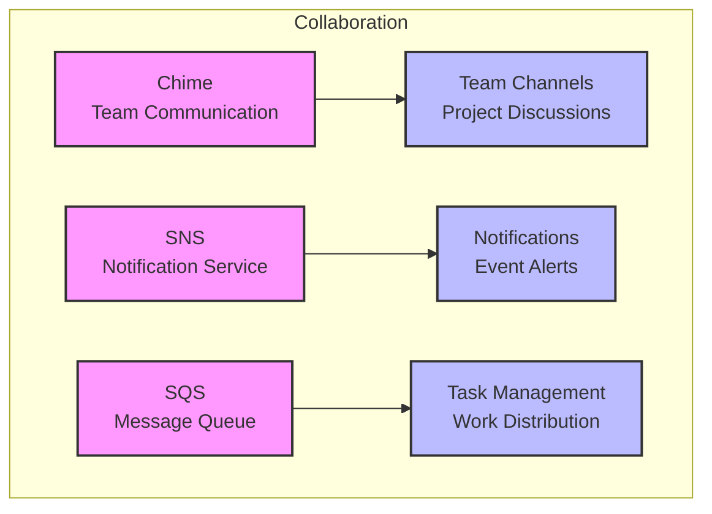
```mermaid
graph TD
    style G fill:#f9f,stroke:#333,stroke-width:2px
    style H fill:#bbf,stroke:#333,stroke-width:2px
    style I fill:#f9f,stroke:#333,stroke-width:2px
    style J fill:#bbf,stroke:#333,stroke-width:2px
    style K fill:#f9f,stroke:#333,stroke-width:2px
    style L fill:#bbf,stroke:#333,stroke-width:2px

    subgraph "Collaboration"
        G[Chime<br/>Team Communication] --> H[Team Channels<br/>Project Discussions]
        I[SNS<br/>Notification Service] --> J[Notifications<br/>Event Alerts]
        K[SQS<br/>Message Queue] --> L[Task Management<br/>Work Distribution]
    end
```

The Collaboration system enables effective team communication and task management through integrated messaging, notifications, and task distribution.

##### Monitoring
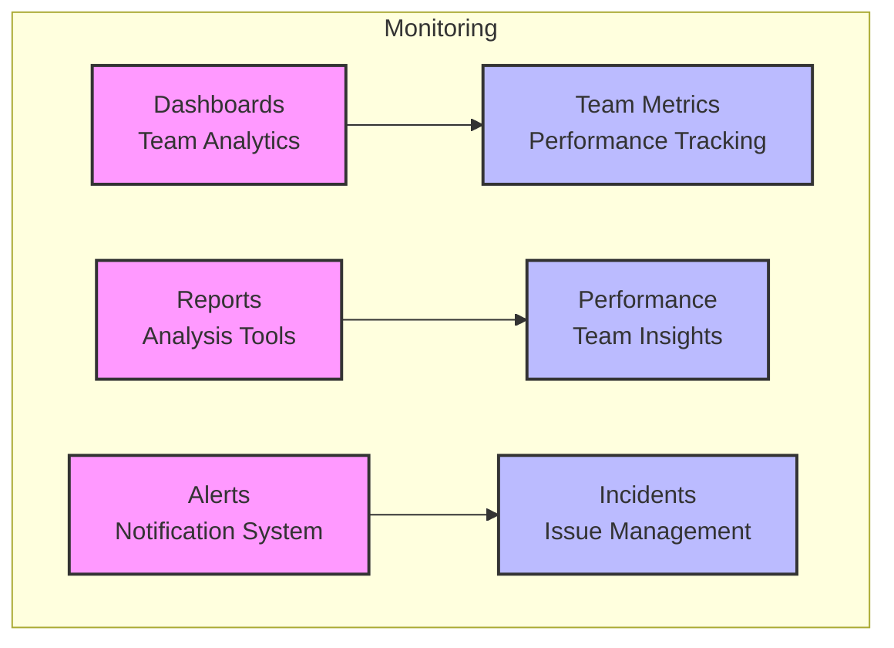
```mermaid
graph TD
    style M fill:#f9f,stroke:#333,stroke-width:2px
    style N fill:#bbf,stroke:#333,stroke-width:2px
    style O fill:#f9f,stroke:#333,stroke-width:2px
    style P fill:#bbf,stroke:#333,stroke-width:2px
    style Q fill:#f9f,stroke:#333,stroke-width:2px
    style R fill:#bbf,stroke:#333,stroke-width:2px

    subgraph "Monitoring"
        M[Dashboards<br/>Team Analytics] --> N[Team Metrics<br/>Performance Tracking]
        O[Reports<br/>Analysis Tools] --> P[Performance<br/>Team Insights]
        Q[Alerts<br/>Notification System] --> R[Incidents<br/>Issue Management]
    end
```

The Monitoring system provides comprehensive team performance tracking and incident management through real-time dashboards and automated alerts.

### Component Relationships

#### AI/ML Pipeline Integration
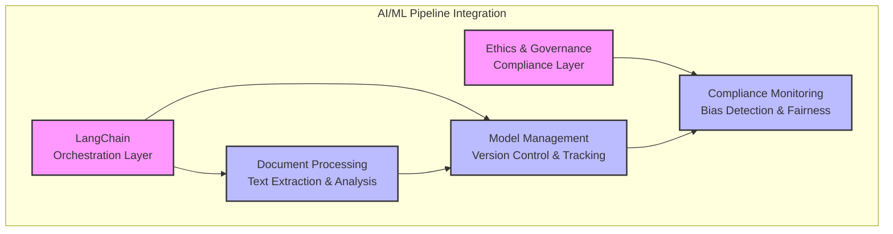
```mermaid
graph TD
    style A fill:#f9f,stroke:#333,stroke-width:2px
    style B fill:#bbf,stroke:#333,stroke-width:2px
    style C fill:#bbf,stroke:#333,stroke-width:2px
    style D fill:#f9f,stroke:#333,stroke-width:2px
    style E fill:#bbf,stroke:#333,stroke-width:2px

    subgraph "AI/ML Pipeline Integration"
        A[LangChain<br/>Orchestration Layer] --> B[Document Processing<br/>Text Extraction & Analysis]
        A --> C[Model Management<br/>Version Control & Tracking]
        D[Ethics & Governance<br/>Compliance Layer] --> E[Compliance Monitoring<br/>Bias Detection & Fairness]
        B --> C
        C --> E
    end
```

The AI/ML Pipeline components work together to process documents, manage models, and ensure ethical compliance. LangChain orchestrates the document processing and model management workflows, while the Ethics & Governance system monitors compliance throughout the pipeline.

**Technical Details:**
- LangChain uses sequential chains for document processing with a maximum token limit of 4096
- Model Management integrates with MLflow for experiment tracking and model versioning
- Ethics & Governance system performs real-time bias detection using statistical analysis
- Document processing includes OCR, text extraction, and entity recognition
- Model versioning includes metadata tracking and performance metrics

#### Infrastructure Integration
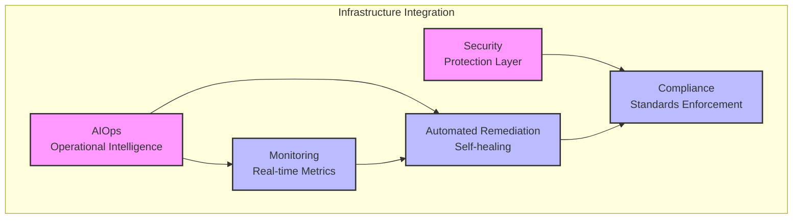
```mermaid
graph TD
    style A fill:#f9f,stroke:#333,stroke-width:2px
    style B fill:#bbf,stroke:#333,stroke-width:2px
    style C fill:#bbf,stroke:#333,stroke-width:2px
    style D fill:#f9f,stroke:#333,stroke-width:2px
    style E fill:#bbf,stroke:#333,stroke-width:2px

    subgraph "Infrastructure Integration"
        A[AIOps<br/>Operational Intelligence] --> B[Monitoring<br/>Real-time Metrics]
        A --> C[Automated Remediation<br/>Self-healing]
        D[Security<br/>Protection Layer] --> E[Compliance<br/>Standards Enforcement]
        B --> C
        C --> E
    end
```

The Infrastructure components are tightly integrated to provide comprehensive monitoring, automated remediation, and security compliance. AIOps drives the monitoring and remediation processes, while the Security system ensures compliance across all infrastructure components.

**Technical Details:**
- AIOps uses Isolation Forest for anomaly detection with a 99.9% confidence interval
- Monitoring system collects metrics at 1-minute intervals with 15-day retention
- Automated remediation triggers scaling actions when CPU > 80% for 5 minutes
- Security system performs continuous vulnerability scanning
- Compliance checks run every 6 hours with automated reporting

#### Team Collaboration Integration
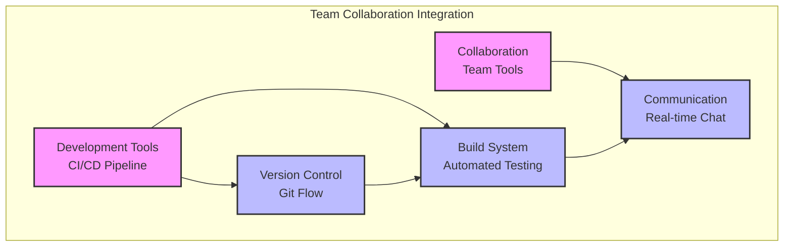
```mermaid
graph TD
    style A fill:#f9f,stroke:#333,stroke-width:2px
    style B fill:#bbf,stroke:#333,stroke-width:2px
    style C fill:#bbf,stroke:#333,stroke-width:2px
    style D fill:#f9f,stroke:#333,stroke-width:2px
    style E fill:#bbf,stroke:#333,stroke-width:2px

    subgraph "Team Collaboration Integration"
        A[Development Tools<br/>CI/CD Pipeline] --> B[Version Control<br/>Git Flow]
        A --> C[Build System<br/>Automated Testing]
        D[Collaboration<br/>Team Tools] --> E[Communication<br/>Real-time Chat]
        B --> C
        C --> E
    end
```

The Team Collaboration components work together to streamline development workflows and enhance team communication. Development Tools integrate with the CI/CD pipeline and version control system, while the Collaboration system facilitates team communication and coordination.

**Technical Details:**
- CI/CD pipeline includes automated testing with 90% coverage requirement
- Version control follows Git Flow with protected main branch
- Build system uses parallel test execution
- Collaboration tools integrate with JIRA for issue tracking
- Real-time chat includes automated notifications for critical events

#### Vector Database Integration
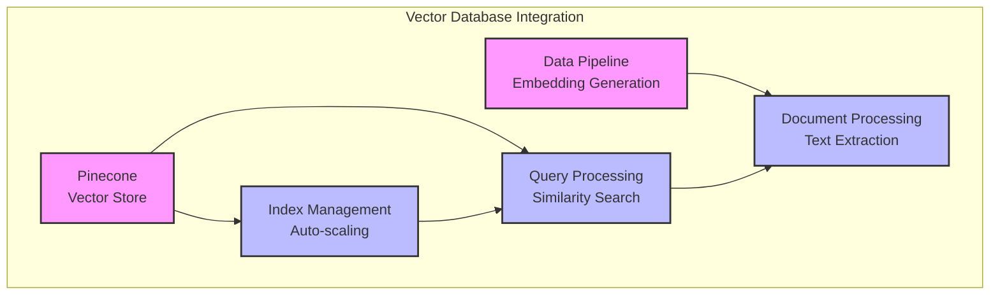
```mermaid
graph TD
    style A fill:#f9f,stroke:#333,stroke-width:2px
    style B fill:#bbf,stroke:#333,stroke-width:2px
    style C fill:#bbf,stroke:#333,stroke-width:2px
    style D fill:#f9f,stroke:#333,stroke-width:2px
    style E fill:#bbf,stroke:#333,stroke-width:2px

    subgraph "Vector Database Integration"
        A[Pinecone<br/>Vector Store] --> B[Index Management<br/>Auto-scaling]
        A --> C[Query Processing<br/>Similarity Search]
        D[Data Pipeline<br/>Embedding Generation] --> E[Document Processing<br/>Text Extraction]
        B --> C
        C --> E
    end
```

The Vector Database components work together to provide efficient document storage and retrieval. Pinecone manages the vector store with automatic scaling, while the Data Pipeline handles document processing and embedding generation.

**Technical Details:**
- Pinecone index configured with 1536 dimensions and cosine similarity
- Auto-scaling triggers at 80% capacity with 2x scaling factor
- Query processing includes approximate nearest neighbor search
- Embedding generation uses OpenAI's text-embedding-ada-002 model
- Document processing includes chunking and metadata extraction

#### Monitoring and Analytics Integration
```mermaid
graph TD
    style A fill:#f9f,stroke:#333,stroke-width:2px
    style B fill:#bbf,stroke:#333,stroke-width:2px
    style C fill:#bbf,stroke:#333,stroke-width:2px
    style D fill:#f9f,stroke:#333,stroke-width:2px
    style E fill:#bbf,stroke:#333,stroke-width:2px

    subgraph "Monitoring and Analytics Integration"
        A[CloudWatch<br/>Metrics Collection] --> B[Log Analysis<br/>Pattern Detection]
        A --> C[Alert Management<br/>Notification System]
        D[Grafana<br/>Visualization] --> E[Dashboard<br/>Real-time Monitoring]
        B --> C
        C --> E
    end
```

The Monitoring and Analytics components work together to provide comprehensive system observability. CloudWatch collects metrics and logs, while Grafana provides visualization and alerting capabilities.

**Technical Details:**
- CloudWatch collects metrics at 1-minute intervals
- Log analysis uses pattern matching with 95% confidence threshold
- Alert system includes escalation policies and on-call rotation
- Grafana dashboards refresh every 30 seconds
- Monitoring includes custom metrics for AI model performance

## System Components

### AI/ML Pipeline
- **LangChain Integration**: Advanced chains, custom tools, and agents
- **Model Management**: Versioning, tracking, and lifecycle management
- **Fine-tuning**: Custom model training and optimization
- **Bias Detection**: Ethical AI considerations and bias monitoring

### Vector Database Integration
- **Pinecone Configuration**: Optimized index setup and management
- **Scaling Policies**: Automatic scaling based on query patterns
- **Backup System**: Regular backups and disaster recovery
- **Security**: Access control and encryption

### AIOps and Monitoring
- **Predictive Analytics**: Anomaly detection and metric forecasting
- **Automated Remediation**: Self-healing capabilities
- **Performance Optimization**: Resource optimization recommendations
- **Dashboard**: Real-time monitoring and alerts

### Security and Compliance
- **AWS Security Hub**: Centralized security management
- **GuardDuty**: Threat detection
- **WAF**: Web application firewall
- **Compliance Monitoring**: Automated compliance checks

### Team Collaboration
- **Code Review**: Automated review workflows
- **Incident Response**: Team coordination and alerting
- **Metrics Dashboard**: Team performance tracking
- **Documentation**: Automated documentation generation

## Technologies Used
- **AI/ML**: LangChain, Bedrock, MLflow, DVC
- **Vector Databases**: Pinecone
- **Cloud Services**: AWS (ECS, S3, Lambda, SageMaker)
- **Monitoring**: CloudWatch, Prometheus, Grafana
- **CI/CD**: GitHub Actions, Terraform
- **Security**: AWS Security Hub, GuardDuty, WAF

## Setup Instructions
1. Clone the repository
2. Install dependencies: `pip install -r requirements.txt`
3. Configure AWS credentials
4. Set up MLflow tracking server
5. Initialize Pinecone
6. Deploy infrastructure: `terraform apply`

## Development Guide
1. Set up development environment
2. Follow coding standards
3. Write tests for new features
4. Use pre-commit hooks
5. Document changes

## Deployment
1. Run tests: `pytest`
2. Build containers: `docker build`
3. Deploy to ECS: `terraform apply`
4. Verify deployment
5. Monitor initial metrics

## Monitoring and Maintenance
1. Check CloudWatch dashboards
2. Review security findings
3. Monitor model performance
4. Update documentation
5. Perform regular backups

## Contributing
1. Fork the repository
2. Create feature branch
3. Submit pull request
4. Address review comments
5. Merge after approval

## License
MIT License

## Contact

For questions or support, please open an issue in the repository. 