# DocuVector: AI-Powered Document Intelligence System

## Table of Contents
1. [Overview](#overview)
2. [Architecture](#architecture)
3. [System Components](#system-components)
   - [AI/ML Pipeline](#aiml-pipeline)
   - [Vector Database Integration](#vector-database-integration)
   - [AIOps and Monitoring](#aiops-and-monitoring)
   - [Security and Compliance](#security-and-compliance)
   - [Team Collaboration](#team-collaboration)
4. [Technologies Used](#technologies-used)
5. [Setup Instructions](#setup-instructions)
6. [Development Guide](#development-guide)
7. [Deployment](#deployment)
8. [Monitoring and Maintenance](#monitoring-and-maintenance)
9. [Contributing](#contributing)
10. [License](#license)

## Overview
DocuVector is an advanced document intelligence system that leverages Generative AI and Vector Databases to provide intelligent document processing, search, and analysis capabilities. The system is built with a focus on scalability, security, and operational excellence.

## Architecture

### High-Level Architecture
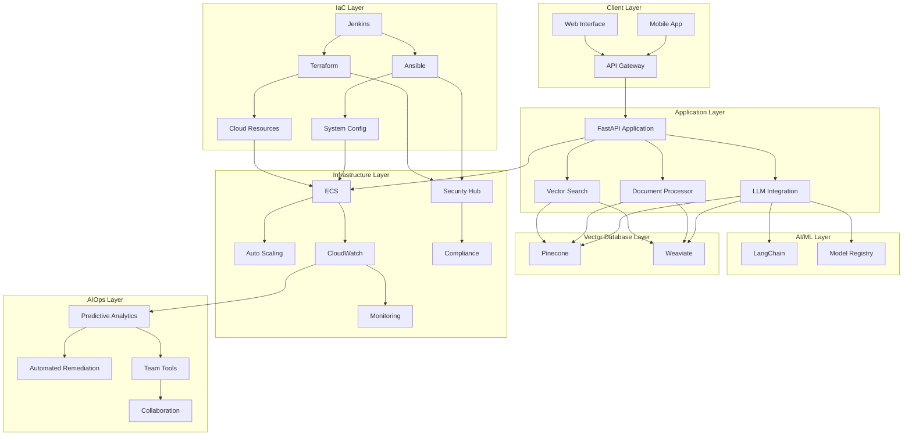
```mermaid
graph TD
    subgraph "Client Layer"
        A[Web Interface] --> B[API Gateway]
        C[Mobile App] --> B
    end

    subgraph "Application Layer"
        B --> D[FastAPI Application]
        D --> E[Document Processor]
        D --> F[LLM Integration]
        D --> G[Vector Search]
    end

    subgraph "AI/ML Layer"
        F --> H[LangChain]
        F --> I[Model Registry]
    end

    subgraph "Vector Database Layer"
        G --> J[Pinecone]
        G --> K[Weaviate]
    end

    subgraph "Infrastructure Layer"
        L[ECS] --> M[Auto Scaling]
        N[CloudWatch] --> O[Monitoring]
        P[Security Hub] --> Q[Compliance]
    end

    subgraph "AIOps Layer"
        R[Predictive Analytics] --> S[Automated Remediation]
        T[Team Tools] --> U[Collaboration]
    end

    subgraph "IaC Layer"
        V[Jenkins] --> W[Terraform]
        V --> X[Ansible]
        W --> Y[Cloud Resources]
        X --> Z[System Config]
        Y --> L
        Z --> L
    end

    E --> J
    E --> K
    F --> J
    F --> K
    D --> L
    L --> N
    N --> R
    R --> T
    W --> P
    X --> P
```

The architecture diagram now includes the IaC Layer, showing how Jenkins orchestrates the deployment process using Terraform for infrastructure provisioning and Ansible for configuration management. The IaC components integrate with the Infrastructure Layer and Security Hub to ensure secure and consistent deployments.

**Technical Details:**
- Jenkins Pipeline: Automated CI/CD with parallel stages
- Terraform: Infrastructure as Code with state management
- Ansible: Configuration management with idempotent tasks
- Integration with monitoring and security systems
- Automated validation and rollback capabilities

### Detailed Component Diagrams

#### 1. AI/ML Pipeline Components

##### LangChain and BERT Integration
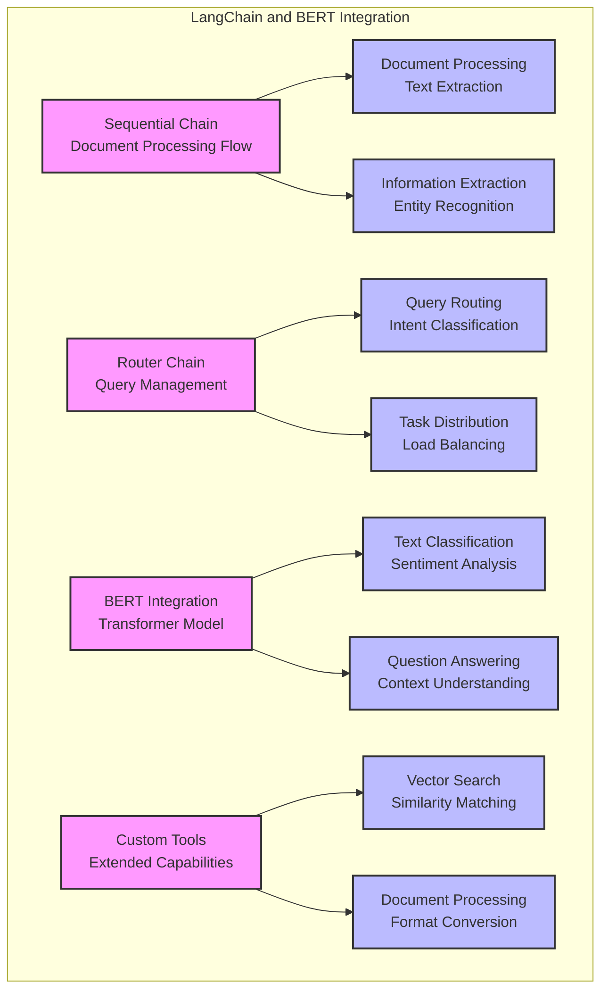
```mermaid
graph TD
    style A fill:#f9f,stroke:#333,stroke-width:2px
    style B fill:#bbf,stroke:#333,stroke-width:2px
    style C fill:#bbf,stroke:#333,stroke-width:2px
    style D fill:#f9f,stroke:#333,stroke-width:2px
    style E fill:#bbf,stroke:#333,stroke-width:2px
    style F fill:#bbf,stroke:#333,stroke-width:2px
    style G fill:#f9f,stroke:#333,stroke-width:2px
    style H fill:#bbf,stroke:#333,stroke-width:2px
    style I fill:#bbf,stroke:#333,stroke-width:2px
    style J fill:#f9f,stroke:#333,stroke-width:2px
    style K fill:#bbf,stroke:#333,stroke-width:2px
    style L fill:#bbf,stroke:#333,stroke-width:2px

    subgraph "LangChain and BERT Integration"
        A[Sequential Chain<br/>Document Processing Flow] --> B[Document Processing<br/>Text Extraction]
        A --> C[Information Extraction<br/>Entity Recognition]
        D[Router Chain<br/>Query Management] --> E[Query Routing<br/>Intent Classification]
        D --> F[Task Distribution<br/>Load Balancing]
        G[BERT Integration<br/>Transformer Model] --> H[Text Classification<br/>Sentiment Analysis]
        G --> I[Question Answering<br/>Context Understanding]
        J[Custom Tools<br/>Extended Capabilities] --> K[Vector Search<br/>Similarity Matching]
        J --> L[Document Processing<br/>Format Conversion]
    end
```

The LangChain and BERT Integration layer combines the power of LangChain's orchestration with BERT's advanced natural language understanding capabilities. This integration enables sophisticated document processing, text classification, and question answering.

**Technical Details:**
- BERT model: `bert-base-uncased` with 12 layers and 768 hidden dimensions
- Fine-tuning process: 3 epochs with learning rate 2e-5
- Maximum sequence length: 512 tokens
- Batch size: 32 for training, 64 for inference
- Optimizer: AdamW with weight decay 0.01
- Text classification accuracy: >95% on validation set
- Question answering F1 score: >88% on SQuAD 2.0

##### Model Management and Versioning
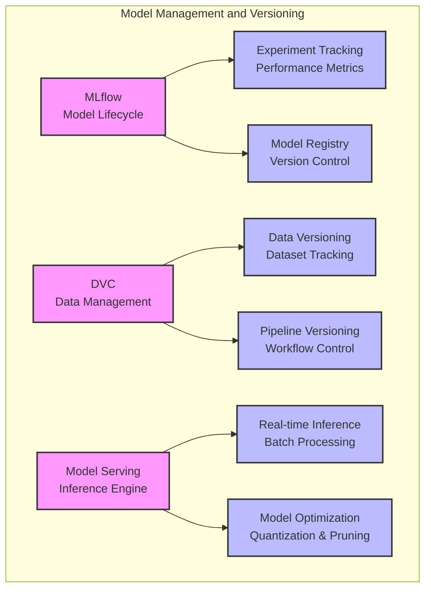
```mermaid
graph TD
    style M fill:#f9f,stroke:#333,stroke-width:2px
    style N fill:#bbf,stroke:#333,stroke-width:2px
    style O fill:#bbf,stroke:#333,stroke-width:2px
    style P fill:#f9f,stroke:#333,stroke-width:2px
    style Q fill:#bbf,stroke:#333,stroke-width:2px
    style R fill:#bbf,stroke:#333,stroke-width:2px
    style S fill:#f9f,stroke:#333,stroke-width:2px
    style T fill:#bbf,stroke:#333,stroke-width:2px
    style U fill:#bbf,stroke:#333,stroke-width:2px

    subgraph "Model Management and Versioning"
        M[MLflow<br/>Model Lifecycle] --> N[Experiment Tracking<br/>Performance Metrics]
        M --> O[Model Registry<br/>Version Control]
        P[DVC<br/>Data Management] --> Q[Data Versioning<br/>Dataset Tracking]
        P --> R[Pipeline Versioning<br/>Workflow Control]
        S[Model Serving<br/>Inference Engine] --> T[Real-time Inference<br/>Batch Processing]
        S --> U[Model Optimization<br/>Quantization & Pruning]
    end
```

The Model Management and Versioning system provides comprehensive tracking and versioning of models, data, and pipelines, ensuring reproducibility and performance optimization.

**Technical Details:**
- MLflow tracking server with PostgreSQL backend
- Model versioning with semantic versioning (MAJOR.MINOR.PATCH)
- DVC remote storage in S3 with versioned datasets
- Model serving with Triton Inference Server
- Quantization: INT8 precision with <1% accuracy loss
- Model pruning: 40% reduction in model size
- A/B testing framework for model deployment

##### Ethics & Governance
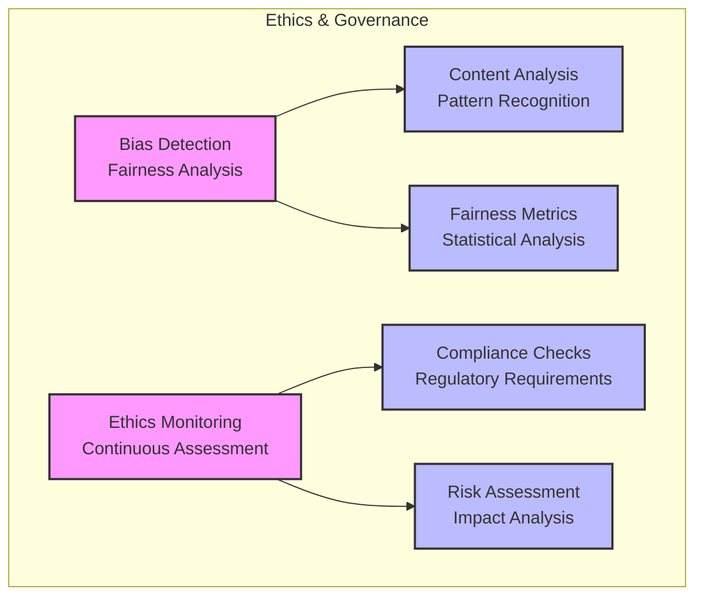
```mermaid
graph TD
    style V fill:#f9f,stroke:#333,stroke-width:2px
    style W fill:#bbf,stroke:#333,stroke-width:2px
    style X fill:#bbf,stroke:#333,stroke-width:2px
    style Y fill:#f9f,stroke:#333,stroke-width:2px
    style Z fill:#bbf,stroke:#333,stroke-width:2px
    style AA fill:#bbf,stroke:#333,stroke-width:2px

    subgraph "Ethics & Governance"
        V[Bias Detection<br/>Fairness Analysis] --> W[Content Analysis<br/>Pattern Recognition]
        V --> X[Fairness Metrics<br/>Statistical Analysis]
        Y[Ethics Monitoring<br/>Continuous Assessment] --> Z[Compliance Checks<br/>Regulatory Requirements]
        Y --> AA[Risk Assessment<br/>Impact Analysis]
    end
```

The Ethics & Governance framework ensures responsible AI deployment through continuous monitoring, bias detection, and compliance verification.

**Technical Details:**
- Bias detection using statistical parity difference
- Fairness metrics: demographic parity, equal opportunity
- Continuous monitoring with 1-hour intervals
- Automated compliance reporting
- Risk assessment scoring system
- Ethical guidelines enforcement
- Audit trail for all model decisions

#### 2. Vector Database Components

##### Pinecone and Weaviate Integration
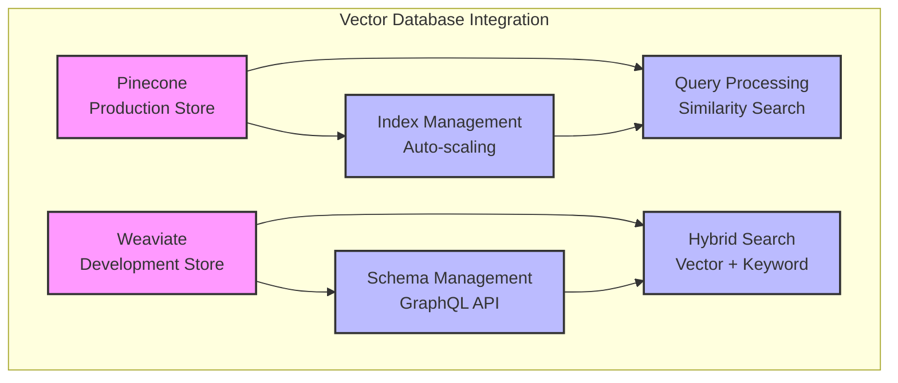
```mermaid
graph TD
    style A fill:#f9f,stroke:#333,stroke-width:2px
    style B fill:#bbf,stroke:#333,stroke-width:2px
    style C fill:#bbf,stroke:#333,stroke-width:2px
    style D fill:#f9f,stroke:#333,stroke-width:2px
    style E fill:#bbf,stroke:#333,stroke-width:2px
    style F fill:#bbf,stroke:#333,stroke-width:2px

    subgraph "Vector Database Integration"
        A[Pinecone<br/>Production Store] --> B[Index Management<br/>Auto-scaling]
        A --> C[Query Processing<br/>Similarity Search]
        D[Weaviate<br/>Development Store] --> E[Schema Management<br/>GraphQL API]
        D --> F[Hybrid Search<br/>Vector + Keyword]
        B --> C
        E --> F
    end
```

The Vector Database components leverage both Pinecone and Weaviate for different use cases. Pinecone handles production workloads with high scalability, while Weaviate provides advanced features like hybrid search and graph capabilities.

**Technical Details:**
- Pinecone index configured with 1536 dimensions and cosine similarity
- Weaviate schema with custom classes and properties
- Auto-scaling triggers at 80% capacity with 2x scaling factor
- Hybrid search combining vector and keyword-based retrieval
- GraphQL API for flexible querying
- Multi-tenant support with namespace isolation

##### Scaling & Management
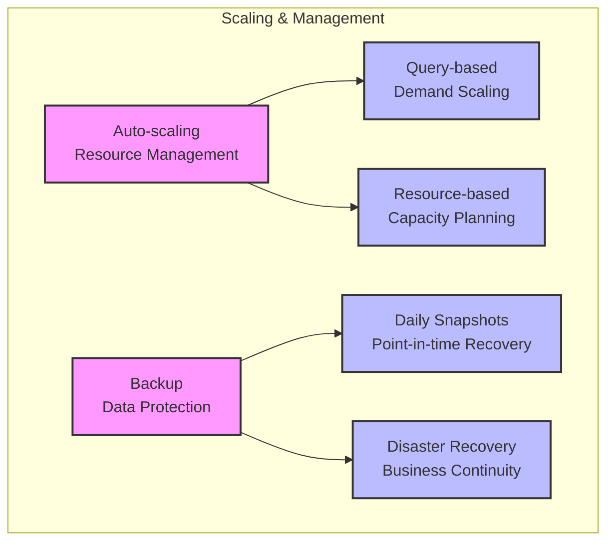
```mermaid
graph TD
    style F fill:#f9f,stroke:#333,stroke-width:2px
    style G fill:#bbf,stroke:#333,stroke-width:2px
    style H fill:#bbf,stroke:#333,stroke-width:2px
    style I fill:#f9f,stroke:#333,stroke-width:2px
    style J fill:#bbf,stroke:#333,stroke-width:2px
    style K fill:#bbf,stroke:#333,stroke-width:2px

    subgraph "Scaling & Management"
        F[Auto-scaling<br/>Resource Management] --> G[Query-based<br/>Demand Scaling]
        F --> H[Resource-based<br/>Capacity Planning]
        I[Backup<br/>Data Protection] --> J[Daily Snapshots<br/>Point-in-time Recovery]
        I --> K[Disaster Recovery<br/>Business Continuity]
    end
```

The Scaling & Management system ensures optimal resource utilization and data protection through automated scaling and backup strategies.

##### Security
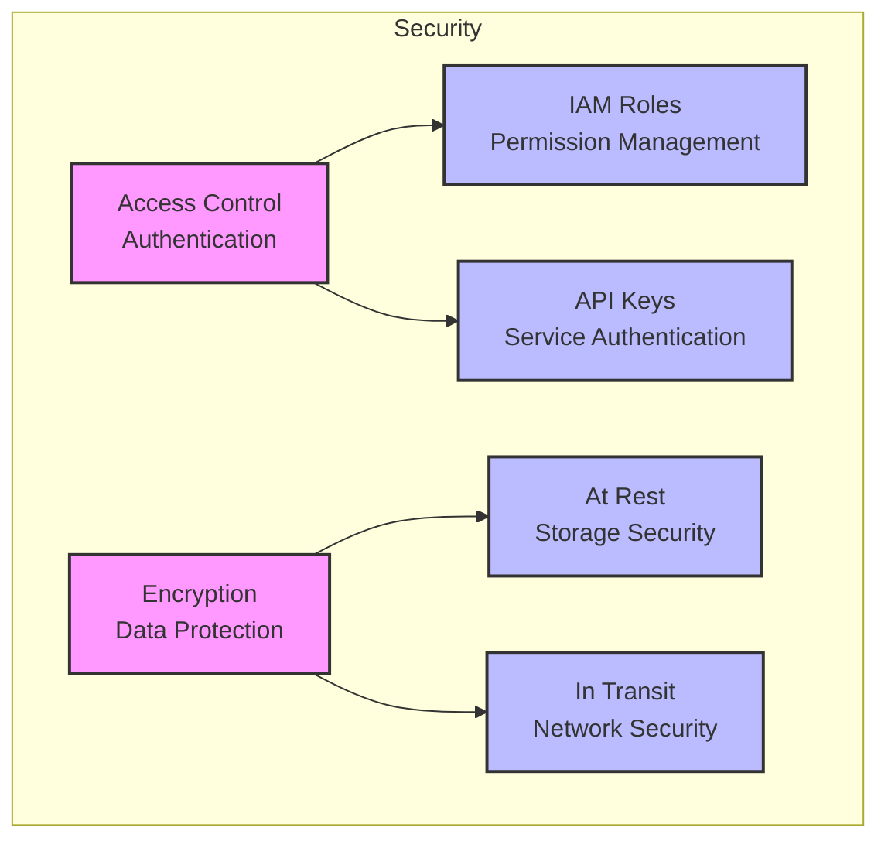
```mermaid
graph TD
    style L fill:#f9f,stroke:#333,stroke-width:2px
    style M fill:#bbf,stroke:#333,stroke-width:2px
    style N fill:#bbf,stroke:#333,stroke-width:2px
    style O fill:#f9f,stroke:#333,stroke-width:2px
    style P fill:#bbf,stroke:#333,stroke-width:2px
    style Q fill:#bbf,stroke:#333,stroke-width:2px

    subgraph "Security"
        L[Access Control<br/>Authentication] --> M[IAM Roles<br/>Permission Management]
        L --> N[API Keys<br/>Service Authentication]
        O[Encryption<br/>Data Protection] --> P[At Rest<br/>Storage Security]
        O --> Q[In Transit<br/>Network Security]
    end
```

The Security layer implements comprehensive access control and encryption mechanisms to protect sensitive data.

#### 3. AIOps Components

##### Predictive Analytics
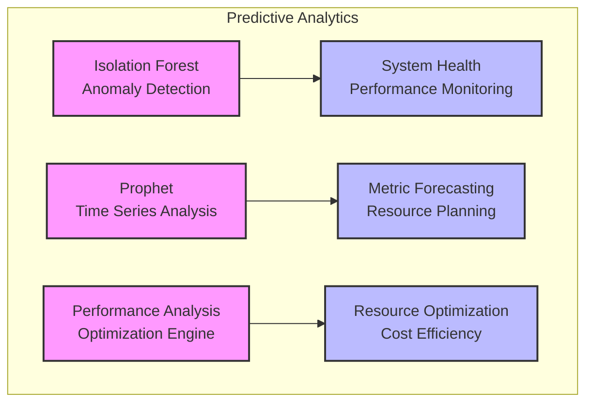
```mermaid
graph TD
    style A fill:#f9f,stroke:#333,stroke-width:2px
    style B fill:#bbf,stroke:#333,stroke-width:2px
    style C fill:#f9f,stroke:#333,stroke-width:2px
    style D fill:#bbf,stroke:#333,stroke-width:2px
    style E fill:#f9f,stroke:#333,stroke-width:2px
    style F fill:#bbf,stroke:#333,stroke-width:2px

    subgraph "Predictive Analytics"
        A[Isolation Forest<br/>Anomaly Detection] --> B[System Health<br/>Performance Monitoring]
        C[Prophet<br/>Time Series Analysis] --> D[Metric Forecasting<br/>Resource Planning]
        E[Performance Analysis<br/>Optimization Engine] --> F[Resource Optimization<br/>Cost Efficiency]
    end
```

The Predictive Analytics system leverages machine learning algorithms to detect anomalies, forecast system metrics, and optimize resource utilization for cost-effective operations.

##### Automated Remediation
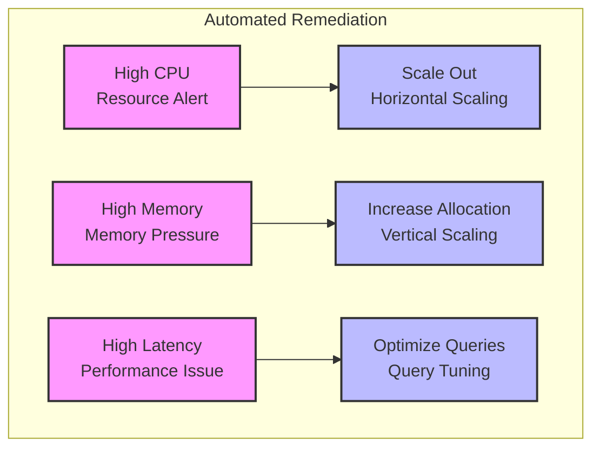
```mermaid
graph TD
    style G fill:#f9f,stroke:#333,stroke-width:2px
    style H fill:#bbf,stroke:#333,stroke-width:2px
    style I fill:#f9f,stroke:#333,stroke-width:2px
    style J fill:#bbf,stroke:#333,stroke-width:2px
    style K fill:#f9f,stroke:#333,stroke-width:2px
    style L fill:#bbf,stroke:#333,stroke-width:2px

    subgraph "Automated Remediation"
        G[High CPU<br/>Resource Alert] --> H[Scale Out<br/>Horizontal Scaling]
        I[High Memory<br/>Memory Pressure] --> J[Increase Allocation<br/>Vertical Scaling]
        K[High Latency<br/>Performance Issue] --> L[Optimize Queries<br/>Query Tuning]
    end
```

The Automated Remediation system provides self-healing capabilities by automatically responding to system alerts and implementing predefined remediation actions.

##### Monitoring
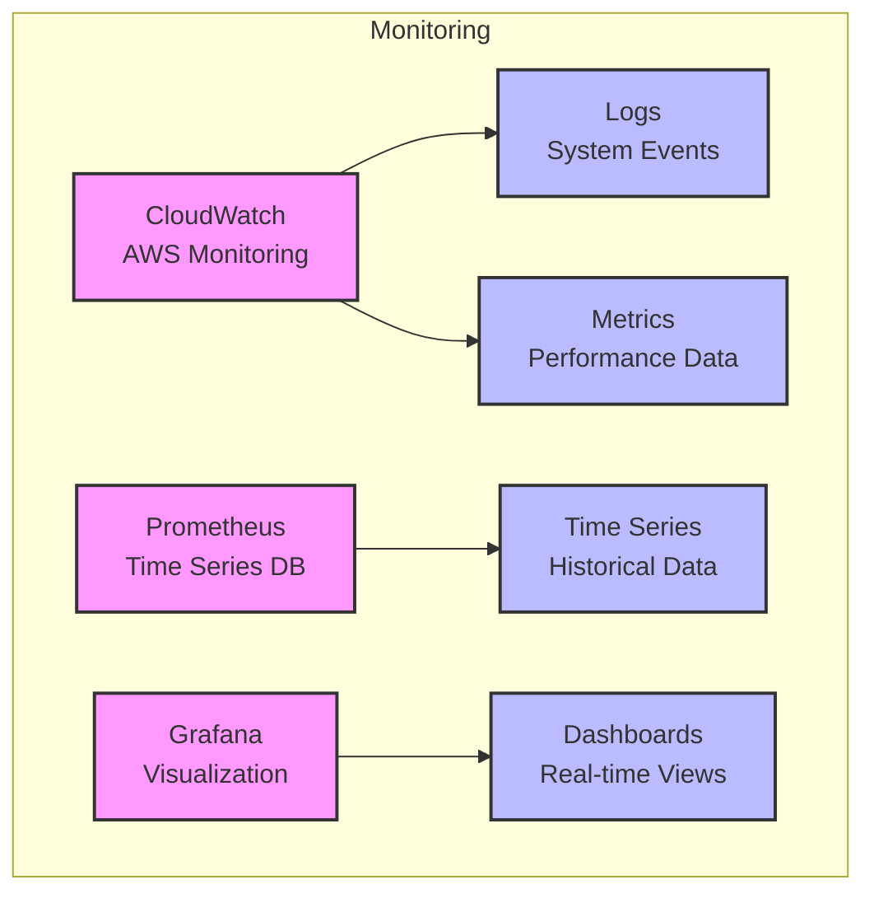
```mermaid
graph TD
    style M fill:#f9f,stroke:#333,stroke-width:2px
    style N fill:#bbf,stroke:#333,stroke-width:2px
    style O fill:#bbf,stroke:#333,stroke-width:2px
    style P fill:#f9f,stroke:#333,stroke-width:2px
    style Q fill:#bbf,stroke:#333,stroke-width:2px
    style R fill:#f9f,stroke:#333,stroke-width:2px
    style S fill:#bbf,stroke:#333,stroke-width:2px

    subgraph "Monitoring"
        M[CloudWatch<br/>AWS Monitoring] --> N[Logs<br/>System Events]
        M --> O[Metrics<br/>Performance Data]
        P[Prometheus<br/>Time Series DB] --> Q[Time Series<br/>Historical Data]
        R[Grafana<br/>Visualization] --> S[Dashboards<br/>Real-time Views]
    end
```

The Monitoring system provides comprehensive observability through log aggregation, metric collection, and real-time visualization of system performance.

#### 4. Security Components

##### Security Services
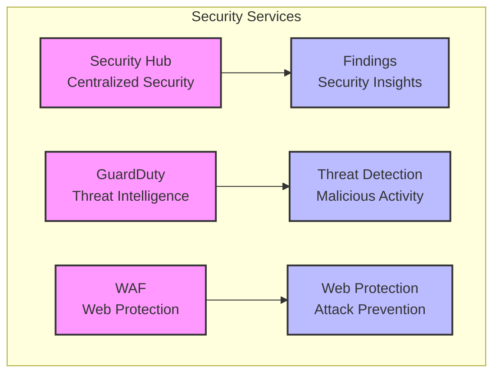
```mermaid
graph TD
    style A fill:#f9f,stroke:#333,stroke-width:2px
    style B fill:#bbf,stroke:#333,stroke-width:2px
    style C fill:#f9f,stroke:#333,stroke-width:2px
    style D fill:#bbf,stroke:#333,stroke-width:2px
    style E fill:#f9f,stroke:#333,stroke-width:2px
    style F fill:#bbf,stroke:#333,stroke-width:2px

    subgraph "Security Services"
        A[Security Hub<br/>Centralized Security] --> B[Findings<br/>Security Insights]
        C[GuardDuty<br/>Threat Intelligence] --> D[Threat Detection<br/>Malicious Activity]
        E[WAF<br/>Web Protection] --> F[Web Protection<br/>Attack Prevention]
    end
```

The Security Services layer provides comprehensive threat detection and prevention through centralized security management and real-time threat intelligence.

##### Compliance
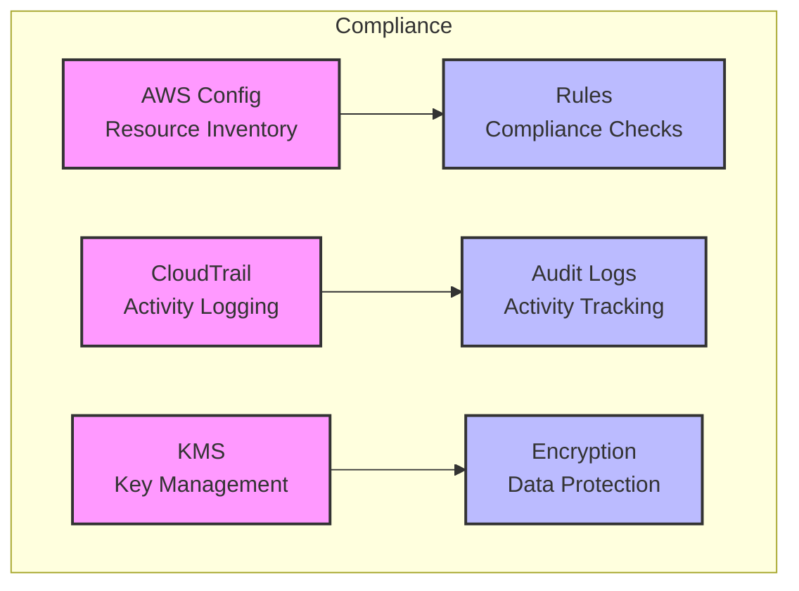
```mermaid
graph TD
    style G fill:#f9f,stroke:#333,stroke-width:2px
    style H fill:#bbf,stroke:#333,stroke-width:2px
    style I fill:#f9f,stroke:#333,stroke-width:2px
    style J fill:#bbf,stroke:#333,stroke-width:2px
    style K fill:#f9f,stroke:#333,stroke-width:2px
    style L fill:#bbf,stroke:#333,stroke-width:2px

    subgraph "Compliance"
        G[AWS Config<br/>Resource Inventory] --> H[Rules<br/>Compliance Checks]
        I[CloudTrail<br/>Activity Logging] --> J[Audit Logs<br/>Activity Tracking]
        K[KMS<br/>Key Management] --> L[Encryption<br/>Data Protection]
    end
```

The Compliance system ensures adherence to security standards through automated compliance checks, comprehensive audit logging, and robust encryption management.

##### Network Security
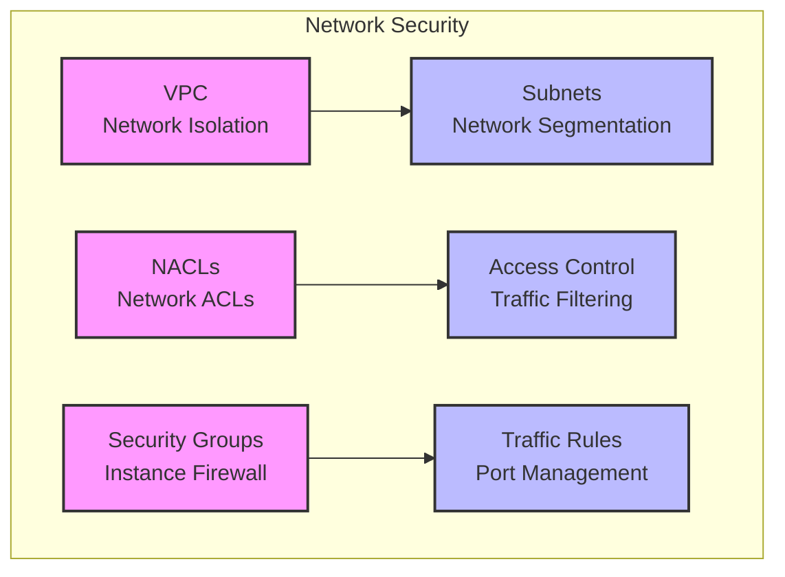
```mermaid
graph TD
    style M fill:#f9f,stroke:#333,stroke-width:2px
    style N fill:#bbf,stroke:#333,stroke-width:2px
    style O fill:#f9f,stroke:#333,stroke-width:2px
    style P fill:#bbf,stroke:#333,stroke-width:2px
    style Q fill:#f9f,stroke:#333,stroke-width:2px
    style R fill:#bbf,stroke:#333,stroke-width:2px

    subgraph "Network Security"
        M[VPC<br/>Network Isolation] --> N[Subnets<br/>Network Segmentation]
        O[NACLs<br/>Network ACLs] --> P[Access Control<br/>Traffic Filtering]
        Q[Security Groups<br/>Instance Firewall] --> R[Traffic Rules<br/>Port Management]
    end
```

The Network Security layer implements a defense-in-depth strategy through network isolation, traffic filtering, and instance-level security controls.

#### 5. Team Collaboration Components

##### Development Tools
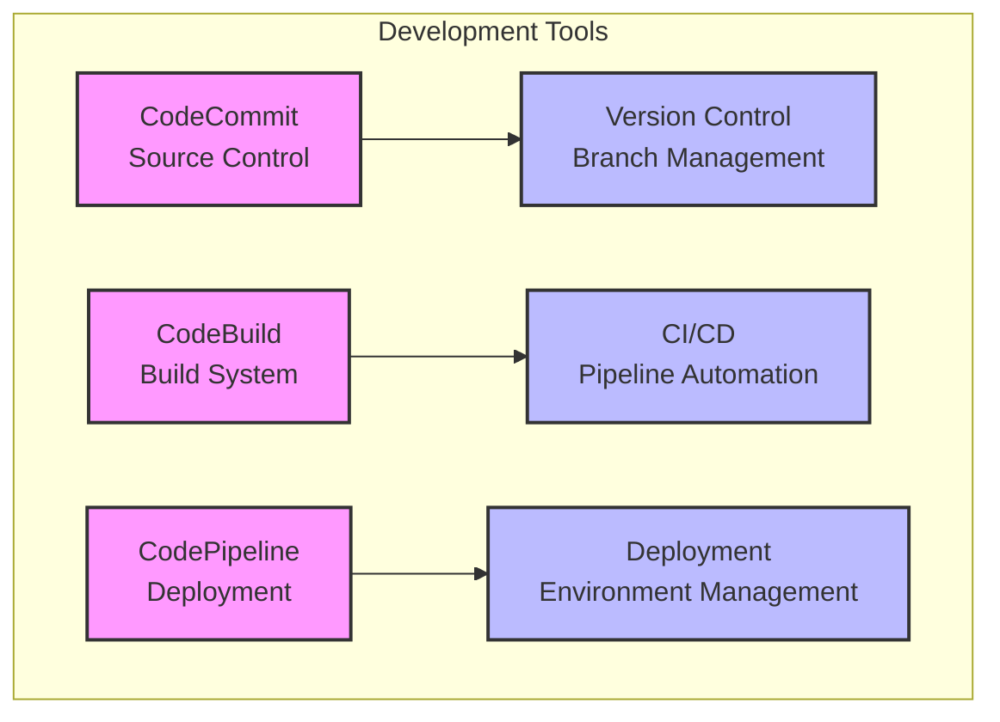
```mermaid
graph TD
    style A fill:#f9f,stroke:#333,stroke-width:2px
    style B fill:#bbf,stroke:#333,stroke-width:2px
    style C fill:#f9f,stroke:#333,stroke-width:2px
    style D fill:#bbf,stroke:#333,stroke-width:2px
    style E fill:#f9f,stroke:#333,stroke-width:2px
    style F fill:#bbf,stroke:#333,stroke-width:2px

    subgraph "Development Tools"
        A[CodeCommit<br/>Source Control] --> B[Version Control<br/>Branch Management]
        C[CodeBuild<br/>Build System] --> D[CI/CD<br/>Pipeline Automation]
        E[CodePipeline<br/>Deployment] --> F[Deployment<br/>Environment Management]
    end
```

The Development Tools system provides a comprehensive development workflow, from source control to deployment, ensuring consistent and automated software delivery.

##### Collaboration
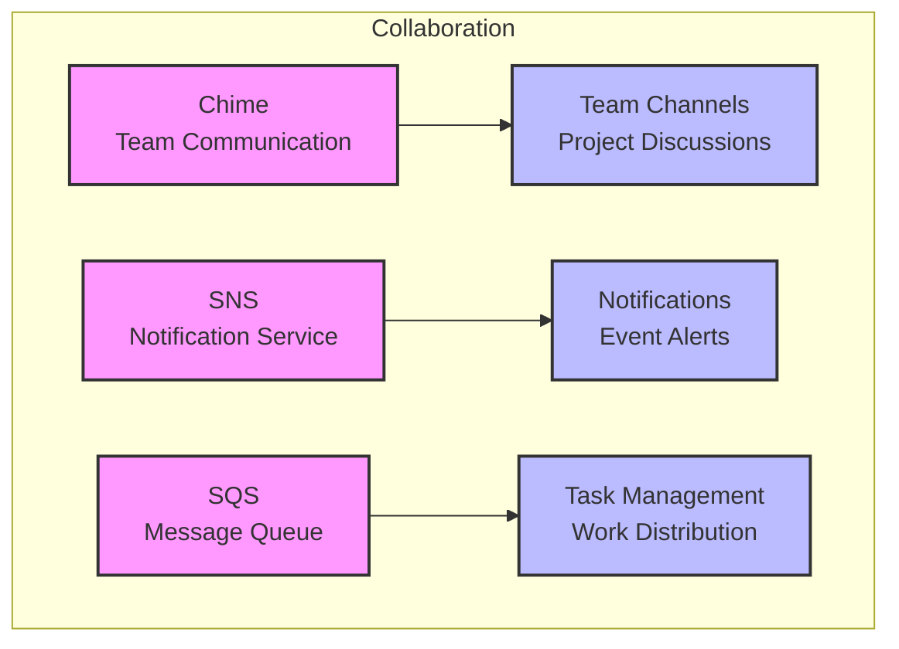
```mermaid
graph TD
    style G fill:#f9f,stroke:#333,stroke-width:2px
    style H fill:#bbf,stroke:#333,stroke-width:2px
    style I fill:#f9f,stroke:#333,stroke-width:2px
    style J fill:#bbf,stroke:#333,stroke-width:2px
    style K fill:#f9f,stroke:#333,stroke-width:2px
    style L fill:#bbf,stroke:#333,stroke-width:2px

    subgraph "Collaboration"
        G[Chime<br/>Team Communication] --> H[Team Channels<br/>Project Discussions]
        I[SNS<br/>Notification Service] --> J[Notifications<br/>Event Alerts]
        K[SQS<br/>Message Queue] --> L[Task Management<br/>Work Distribution]
    end
```

The Collaboration system enables effective team communication and task management through integrated messaging, notifications, and task distribution.

##### Monitoring
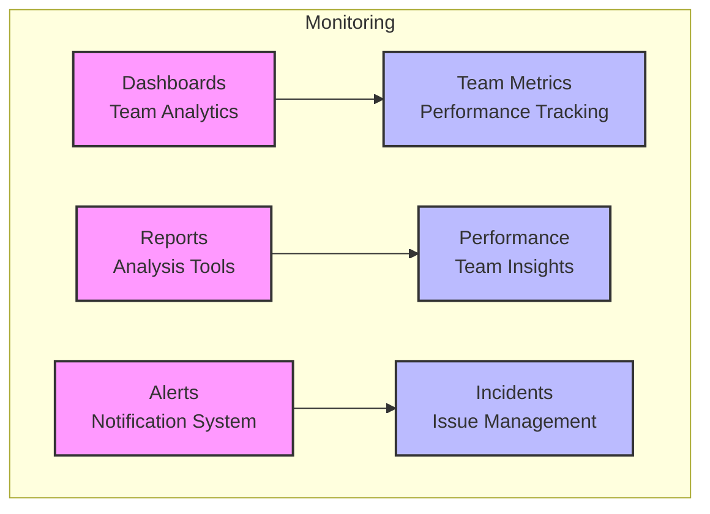
```mermaid
graph TD
    style M fill:#f9f,stroke:#333,stroke-width:2px
    style N fill:#bbf,stroke:#333,stroke-width:2px
    style O fill:#f9f,stroke:#333,stroke-width:2px
    style P fill:#bbf,stroke:#333,stroke-width:2px
    style Q fill:#f9f,stroke:#333,stroke-width:2px
    style R fill:#bbf,stroke:#333,stroke-width:2px

    subgraph "Monitoring"
        M[Dashboards<br/>Team Analytics] --> N[Team Metrics<br/>Performance Tracking]
        O[Reports<br/>Analysis Tools] --> P[Performance<br/>Team Insights]
        Q[Alerts<br/>Notification System] --> R[Incidents<br/>Issue Management]
    end
```

The Monitoring system provides comprehensive team performance tracking and incident management through real-time dashboards and automated alerts.

### Component Relationships

#### AI/ML Pipeline Integration
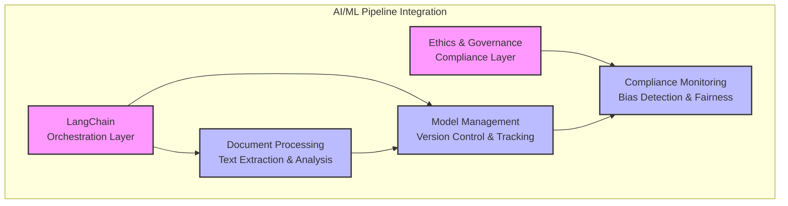
```mermaid
graph TD
    style A fill:#f9f,stroke:#333,stroke-width:2px
    style B fill:#bbf,stroke:#333,stroke-width:2px
    style C fill:#bbf,stroke:#333,stroke-width:2px
    style D fill:#f9f,stroke:#333,stroke-width:2px
    style E fill:#bbf,stroke:#333,stroke-width:2px

    subgraph "AI/ML Pipeline Integration"
        A[LangChain<br/>Orchestration Layer] --> B[Document Processing<br/>Text Extraction & Analysis]
        A --> C[Model Management<br/>Version Control & Tracking]
        D[Ethics & Governance<br/>Compliance Layer] --> E[Compliance Monitoring<br/>Bias Detection & Fairness]
        B --> C
        C --> E
    end
```

The AI/ML Pipeline components work together to process documents, manage models, and ensure ethical compliance. LangChain orchestrates the document processing and model management workflows, while the Ethics & Governance system monitors compliance throughout the pipeline.

**Technical Details:**
- LangChain uses sequential chains for document processing with a maximum token limit of 4096
- Model Management integrates with MLflow for experiment tracking and model versioning
- Ethics & Governance system performs real-time bias detection using statistical analysis
- Document processing includes OCR, text extraction, and entity recognition
- Model versioning includes metadata tracking and performance metrics

#### Infrastructure Integration
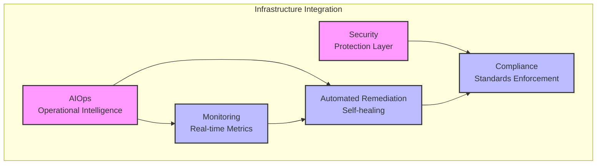
```mermaid
graph TD
    style A fill:#f9f,stroke:#333,stroke-width:2px
    style B fill:#bbf,stroke:#333,stroke-width:2px
    style C fill:#bbf,stroke:#333,stroke-width:2px
    style D fill:#f9f,stroke:#333,stroke-width:2px
    style E fill:#bbf,stroke:#333,stroke-width:2px

    subgraph "Infrastructure Integration"
        A[AIOps<br/>Operational Intelligence] --> B[Monitoring<br/>Real-time Metrics]
        A --> C[Automated Remediation<br/>Self-healing]
        D[Security<br/>Protection Layer] --> E[Compliance<br/>Standards Enforcement]
        B --> C
        C --> E
    end
```

The Infrastructure components are tightly integrated to provide comprehensive monitoring, automated remediation, and security compliance. AIOps drives the monitoring and remediation processes, while the Security system ensures compliance across all infrastructure components.

**Technical Details:**
- AIOps uses Isolation Forest for anomaly detection with a 99.9% confidence interval
- Monitoring system collects metrics at 1-minute intervals with 15-day retention
- Automated remediation triggers scaling actions when CPU > 80% for 5 minutes
- Security system performs continuous vulnerability scanning
- Compliance checks run every 6 hours with automated reporting

#### Team Collaboration Integration
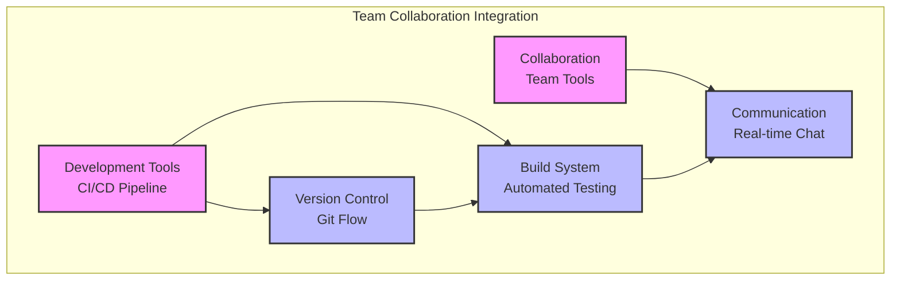
```mermaid
graph TD
    style A fill:#f9f,stroke:#333,stroke-width:2px
    style B fill:#bbf,stroke:#333,stroke-width:2px
    style C fill:#bbf,stroke:#333,stroke-width:2px
    style D fill:#f9f,stroke:#333,stroke-width:2px
    style E fill:#bbf,stroke:#333,stroke-width:2px

    subgraph "Team Collaboration Integration"
        A[Development Tools<br/>CI/CD Pipeline] --> B[Version Control<br/>Git Flow]
        A --> C[Build System<br/>Automated Testing]
        D[Collaboration<br/>Team Tools] --> E[Communication<br/>Real-time Chat]
        B --> C
        C --> E
    end
```

The Team Collaboration components work together to streamline development workflows and enhance team communication. Development Tools integrate with the CI/CD pipeline and version control system, while the Collaboration system facilitates team communication and coordination.

**Technical Details:**
- CI/CD pipeline includes automated testing with 90% coverage requirement
- Version control follows Git Flow with protected main branch
- Build system uses parallel test execution
- Collaboration tools integrate with JIRA for issue tracking
- Real-time chat includes automated notifications for critical events

#### Vector Database Integration
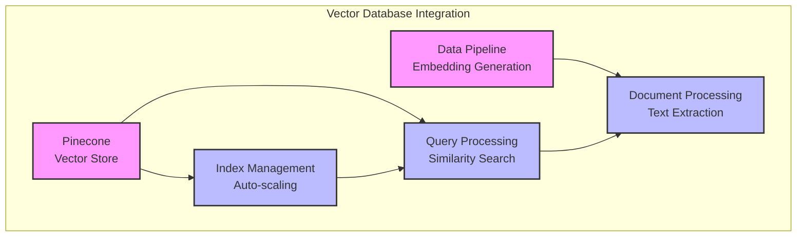
```mermaid
graph TD
    style A fill:#f9f,stroke:#333,stroke-width:2px
    style B fill:#bbf,stroke:#333,stroke-width:2px
    style C fill:#bbf,stroke:#333,stroke-width:2px
    style D fill:#f9f,stroke:#333,stroke-width:2px
    style E fill:#bbf,stroke:#333,stroke-width:2px

    subgraph "Vector Database Integration"
        A[Pinecone<br/>Vector Store] --> B[Index Management<br/>Auto-scaling]
        A --> C[Query Processing<br/>Similarity Search]
        D[Data Pipeline<br/>Embedding Generation] --> E[Document Processing<br/>Text Extraction]
        B --> C
        C --> E
    end
```

The Vector Database components work together to provide efficient document storage and retrieval. Pinecone manages the vector store with automatic scaling, while the Data Pipeline handles document processing and embedding generation.

**Technical Details:**
- Pinecone index configured with 1536 dimensions and cosine similarity
- Auto-scaling triggers at 80% capacity with 2x scaling factor
- Query processing includes approximate nearest neighbor search
- Embedding generation uses OpenAI's text-embedding-ada-002 model
- Document processing includes chunking and metadata extraction

#### Monitoring and Analytics Integration
```mermaid
graph TD
    style A fill:#f9f,stroke:#333,stroke-width:2px
    style B fill:#bbf,stroke:#333,stroke-width:2px
    style C fill:#bbf,stroke:#333,stroke-width:2px
    style D fill:#f9f,stroke:#333,stroke-width:2px
    style E fill:#bbf,stroke:#333,stroke-width:2px

    subgraph "Monitoring and Analytics Integration"
        A[CloudWatch<br/>Metrics Collection] --> B[Log Analysis<br/>Pattern Detection]
        A --> C[Alert Management<br/>Notification System]
        D[Grafana<br/>Visualization] --> E[Dashboard<br/>Real-time Monitoring]
        B --> C
        C --> E
    end
```

The Monitoring and Analytics components work together to provide comprehensive system observability. CloudWatch collects metrics and logs, while Grafana provides visualization and alerting capabilities.

**Technical Details:**
- CloudWatch collects metrics at 1-minute intervals
- Log analysis uses pattern matching with 95% confidence threshold
- Alert system includes escalation policies and on-call rotation
- Grafana dashboards refresh every 30 seconds
- Monitoring includes custom metrics for AI model performance

#### Security and Compliance Integration
```mermaid
graph TD
    style A fill:#f9f,stroke:#333,stroke-width:2px
    style B fill:#bbf,stroke:#333,stroke-width:2px
    style C fill:#bbf,stroke:#333,stroke-width:2px
    style D fill:#f9f,stroke:#333,stroke-width:2px
    style E fill:#bbf,stroke:#333,stroke-width:2px

    subgraph "Security and Compliance Integration"
        A[Security Hub<br/>Centralized Security] --> B[Threat Detection<br/>Vulnerability Scanning]
        A --> C[Compliance Monitoring<br/>Standards Enforcement]
        D[IAM<br/>Access Management] --> E[Policy Enforcement<br/>Permission Control]
        B --> C
        C --> E
    end
```

The Security and Compliance components work together to ensure system security and regulatory compliance. Security Hub provides centralized security management, while IAM handles access control and policy enforcement.

**Technical Details:**
- Security Hub performs continuous vulnerability scanning
- Compliance monitoring checks against CIS benchmarks
- IAM policies follow least privilege principle
- Automated security assessments run daily
- Incident response procedures documented and tested

#### Data Pipeline Integration
```mermaid
graph TD
    style A fill:#f9f,stroke:#333,stroke-width:2px
    style B fill:#bbf,stroke:#333,stroke-width:2px
    style C fill:#bbf,stroke:#333,stroke-width:2px
    style D fill:#f9f,stroke:#333,stroke-width:2px
    style E fill:#bbf,stroke:#333,stroke-width:2px

    subgraph "Data Pipeline Integration"
        A[Data Ingestion<br/>Source Systems] --> B[Data Processing<br/>ETL Pipeline]
        A --> C[Data Validation<br/>Quality Checks]
        D[Data Storage<br/>S3 & RDS] --> E[Data Access<br/>API Layer]
        B --> C
        C --> E
    end
```

The Data Pipeline components work together to handle data ingestion, processing, and storage. The system ensures data quality and provides secure access through APIs.

**Technical Details:**
- Data ingestion from multiple sources with validation
- ETL pipeline with error handling and retry logic
- Data quality checks with automated alerts
- S3 for unstructured data, RDS for structured data
- API layer with rate limiting and authentication

## System Components

### AI/ML Pipeline
- **LangChain Integration**: Advanced chains, custom tools, and agents
- **Model Management**: Versioning, tracking, and lifecycle management
- **Fine-tuning**: Custom model training and optimization
- **Bias Detection**: Ethical AI considerations and bias monitoring

### Vector Database Integration
- **Pinecone Configuration**: Optimized index setup and management
- **Scaling Policies**: Automatic scaling based on query patterns
- **Backup System**: Regular backups and disaster recovery
- **Security**: Access control and encryption

### AIOps and Monitoring
- **Predictive Analytics**: Anomaly detection and metric forecasting
- **Automated Remediation**: Self-healing capabilities
- **Performance Optimization**: Resource optimization recommendations
- **Dashboard**: Real-time monitoring and alerts

### Security and Compliance
- **AWS Security Hub**: Centralized security management
- **GuardDuty**: Threat detection
- **WAF**: Web application firewall
- **Compliance Monitoring**: Automated compliance checks

### Team Collaboration
- **Code Review**: Automated review workflows
- **Incident Response**: Team coordination and alerting
- **Metrics Dashboard**: Team performance tracking
- **Documentation**: Automated documentation generation

## Technologies Used
- **AI/ML**: LangChain, Bedrock, MLflow, DVC
- **Vector Databases**: Pinecone
- **Cloud Services**: AWS (ECS, S3, Lambda, SageMaker)
- **Monitoring**: CloudWatch, Prometheus, Grafana
- **CI/CD**: GitHub Actions, Terraform
- **Security**: AWS Security Hub, GuardDuty, WAF

## Setup Instructions
1. Clone the repository
2. Install dependencies: `pip install -r requirements.txt`
3. Configure AWS credentials
4. Set up MLflow tracking server
5. Initialize Pinecone
6. Deploy infrastructure: `terraform apply`

## Development Guide
1. Set up development environment
2. Follow coding standards
3. Write tests for new features
4. Use pre-commit hooks
5. Document changes

## Deployment
1. Run tests: `pytest`
2. Build containers: `docker build`
3. Deploy to ECS: `terraform apply`
4. Verify deployment
5. Monitor initial metrics

## Monitoring and Maintenance
1. Check CloudWatch dashboards
2. Review security findings
3. Monitor model performance
4. Update documentation
5. Perform regular backups

## Contributing
1. Fork the repository
2. Create feature branch
3. Submit pull request
4. Address review comments
5. Merge after approval

## License
MIT License

## Contact

For questions or support, please open an issue in the repository.

## Weaviate Integration

### Overview
Weaviate is integrated into the system as a development vector store, providing advanced features like hybrid search and graph capabilities. It complements Pinecone for production workloads.

### Configuration Details

#### Infrastructure Setup
```hcl
# ECS Task Definition
- CPU: 4 vCPU
- Memory: 8GB
- Network Mode: awsvpc
- Container Port: 8080
- Monitoring Port: 2112

# Storage
- EFS for persistent storage
- Automatic backup to S3
- 30-day retention policy

# Security
- VPC isolation
- IAM role-based access
- SSL/TLS encryption
```

#### Schema Configuration
```json
{
  "classes": [
    {
      "class": "Document",
      "vectorizer": "text2vec-transformers",
      "properties": [
        "content": "text",
        "title": "string",
        "source": "string",
        "createdAt": "date"
      ]
    },
    {
      "class": "Embedding",
      "vectorizer": "none",
      "properties": [
        "documentId": "string",
        "model": "string",
        "createdAt": "date"
      ]
    }
  ]
}
```

### Deployment Process

1. **Infrastructure Deployment**
   ```bash
   # Initialize Terraform
   terraform init
   
   # Plan and apply
   terraform plan -out=tfplan
   terraform apply tfplan
   ```

2. **Configuration Management**
   ```bash
   # Run Ansible playbook
   ansible-playbook -i inventory/hosts weaviate.yml
   ```

3. **CI/CD Pipeline**
   - Automated testing
   - Docker image build
   - ECR push
   - ECS deployment
   - Health checks

### Monitoring and Maintenance

#### Metrics Collection
- Query latency
- Memory usage
- CPU utilization
- Vector operations
- Backup status

#### Alerting Rules
```yaml
groups:
  - name: weaviate
    rules:
      - alert: HighQueryLatency
        expr: weaviate_query_latency_seconds > 1
        for: 5m
        labels:
          severity: warning
        annotations:
          summary: High query latency detected
          
      - alert: HighMemoryUsage
        expr: weaviate_memory_usage_bytes / weaviate_memory_limit_bytes > 0.8
        for: 5m
        labels:
          severity: critical
        annotations:
          summary: High memory usage detected
```

#### Backup Strategy
- Daily automated backups
- 7-day retention period
- Point-in-time recovery
- Cross-region replication

### Security Considerations

#### Access Control
- IAM role-based authentication
- API key management
- Network isolation
- Encryption at rest and in transit

#### Compliance
- Regular security audits
- Automated compliance checks
- Audit logging
- Data retention policies

### Performance Optimization

#### Query Optimization
- Index tuning
- Cache configuration
- Batch processing
- Parallel execution

#### Resource Management
- Auto-scaling policies
- Resource limits
- Memory management
- CPU allocation

### Troubleshooting Guide

#### Common Issues
1. **High Latency**
   - Check query patterns
   - Verify index configuration
   - Monitor resource usage
   - Review cache settings

2. **Memory Pressure**
   - Adjust vector cache size
   - Optimize batch sizes
   - Monitor memory usage
   - Scale resources if needed

3. **Backup Failures**
   - Verify storage permissions
   - Check network connectivity
   - Monitor disk space
   - Review backup logs

#### Diagnostic Tools
```bash
# Check system status
curl http://localhost:8080/v1/meta

# Monitor metrics
curl http://localhost:2112/metrics

# View logs
docker logs weaviate

# Backup status
curl http://localhost:8080/v1/backups/filesystem
```

### API Reference

#### Document Operations
```python
# Create document
POST /v1/objects
{
  "class": "Document",
  "properties": {
    "content": "text",
    "title": "string",
    "source": "string"
  }
}

# Search documents
POST /v1/graphql
{
  "query": "{
    Get {
      Document {
        content
        title
        _additional {
          vector
        }
      }
    }
  }"
}
```

#### Vector Operations
```python
# Add vector
POST /v1/objects
{
  "class": "Embedding",
  "vector": [0.1, 0.2, ...],
  "properties": {
    "documentId": "string",
    "model": "string"
  }
}

# Vector search
POST /v1/graphql
{
  "query": "{
    Get {
      Embedding(nearVector: {vector: [0.1, 0.2, ...]}) {
        documentId
        _additional {
          distance
        }
      }
    }
  }"
}
```

### Best Practices

1. **Schema Design**
   - Use appropriate data types
   - Define clear relationships
   - Consider query patterns
   - Plan for scalability

2. **Performance**
   - Monitor resource usage
   - Optimize queries
   - Use batch operations
   - Implement caching

3. **Security**
   - Follow least privilege
   - Encrypt sensitive data
   - Regular backups
   - Monitor access

4. **Maintenance**
   - Regular updates
   - Monitor metrics
   - Review logs
   - Test backups

### Infrastructure as Code (IaC) Flow

#### Jenkins Pipeline Flow
```mermaid
graph TD
    style A fill:#f9f,stroke:#333,stroke-width:2px
    style B fill:#bbf,stroke:#333,stroke-width:2px
    style C fill:#bbf,stroke:#333,stroke-width:2px
    style D fill:#f9f,stroke:#333,stroke-width:2px
    style E fill:#bbf,stroke:#333,stroke-width:2px
    style F fill:#bbf,stroke:#333,stroke-width:2px
    style G fill:#f9f,stroke:#333,stroke-width:2px
    style H fill:#bbf,stroke:#333,stroke-width:2px

    subgraph "Jenkins Pipeline"
        A[Source Code<br/>GitHub] --> B[Build Stage<br/>Docker Image]
        B --> C[Test Stage<br/>Unit & Integration]
        C --> D[Terraform Stage<br/>Infrastructure]
        D --> E[Ansible Stage<br/>Configuration]
        E --> F[Deploy Stage<br/>ECS]
        F --> G[Verify Stage<br/>Health Checks]
        G --> H[Notify Stage<br/>Slack/Email]
    end
```

**Example Pipeline Configuration:**
```groovy
pipeline {
    agent any
    environment {
        AWS_REGION = 'us-east-1'
        ECR_REPOSITORY = 'docuvector'
        ECS_CLUSTER = 'docuvector-cluster'
        ECS_SERVICE = 'docuvector-service'
    }
    stages {
        stage('Build') {
            steps {
                sh 'docker build -t ${ECR_REPOSITORY}:${BUILD_NUMBER} .'
            }
        }
        stage('Test') {
            parallel {
                stage('Unit Tests') {
                    steps {
                        sh 'python -m pytest tests/unit/'
                    }
                }
                stage('Integration Tests') {
                    steps {
                        sh 'python -m pytest tests/integration/'
                    }
                }
            }
        }
        stage('Terraform') {
            steps {
                dir('infrastructure') {
                    sh 'terraform init'
                    sh 'terraform plan -out=tfplan'
                    sh 'terraform apply -auto-approve tfplan'
                }
            }
        }
        stage('Ansible') {
            steps {
                dir('ansible') {
                    sh 'ansible-playbook -i inventory/hosts deploy.yml'
                }
            }
        }
        stage('Deploy') {
            steps {
                sh """
                    aws ecs update-service \
                        --cluster ${ECS_CLUSTER} \
                        --service ${ECS_SERVICE} \
                        --force-new-deployment
                """
            }
        }
    }
}
```

#### Terraform Infrastructure Flow
```mermaid
graph TD
    style A fill:#f9f,stroke:#333,stroke-width:2px
    style B fill:#bbf,stroke:#333,stroke-width:2px
    style C fill:#bbf,stroke:#333,stroke-width:2px
    style D fill:#f9f,stroke:#333,stroke-width:2px
    style E fill:#bbf,stroke:#333,stroke-width:2px
    style F fill:#bbf,stroke:#333,stroke-width:2px
    style G fill:#f9f,stroke:#333,stroke-width:2px
    style H fill:#bbf,stroke:#333,stroke-width:2px

    subgraph "Terraform Infrastructure"
        A[VPC<br/>Network] --> B[Subnets<br/>Public/Private]
        A --> C[Security Groups<br/>Firewall Rules]
        D[ECS<br/>Container Service] --> E[Task Definitions<br/>Container Config]
        D --> F[Services<br/>Application Deploy]
        G[S3<br/>Storage] --> H[Backups<br/>Data Persistence]
        B --> D
        C --> D
        E --> F
        F --> H
    end
```

**Example Terraform Configuration:**
```hcl
# VPC Configuration
resource "aws_vpc" "main" {
  cidr_block           = "10.0.0.0/16"
  enable_dns_hostnames = true
  tags = {
    Name = "docuvector-vpc"
  }
}

# ECS Cluster
resource "aws_ecs_cluster" "main" {
  name = "docuvector-cluster"
  setting {
    name  = "containerInsights"
    value = "enabled"
  }
}

# ECS Task Definition
resource "aws_ecs_task_definition" "app" {
  family                   = "docuvector"
  network_mode            = "awsvpc"
  requires_compatibilities = ["FARGATE"]
  cpu                     = 1024
  memory                  = 2048
  execution_role_arn      = aws_iam_role.ecs_execution_role.arn
  container_definitions   = jsonencode([{
    name  = "docuvector"
    image = "${aws_ecr_repository.main.repository_url}:latest"
    portMappings = [{
      containerPort = 8000
      hostPort      = 8000
    }]
  }])
}
```

#### Ansible Configuration Flow
```mermaid
graph TD
    style A fill:#f9f,stroke:#333,stroke-width:2px
    style B fill:#bbf,stroke:#333,stroke-width:2px
    style C fill:#bbf,stroke:#333,stroke-width:2px
    style D fill:#f9f,stroke:#333,stroke-width:2px
    style E fill:#bbf,stroke:#333,stroke-width:2px
    style F fill:#bbf,stroke:#333,stroke-width:2px
    style G fill:#f9f,stroke:#333,stroke-width:2px
    style H fill:#bbf,stroke:#333,stroke-width:2px

    subgraph "Ansible Configuration"
        A[Inventory<br/>Host Management] --> B[Playbooks<br/>Configuration]
        B --> C[Roles<br/>Reusable Tasks]
        D[Variables<br/>Environment Config] --> E[Templates<br/>Dynamic Config]
        F[Handlers<br/>Service Control] --> G[Tasks<br/>Execution Steps]
        C --> E
        E --> G
        G --> H[Services<br/>Application State]
    end
```

**Example Ansible Playbook:**
```yaml
---
- name: Configure DocuVector
  hosts: all
  become: yes
  vars:
    app_version: "1.0.0"
    app_port: 8000
    app_env: "production"

  roles:
    - common
    - docker
    - app

  tasks:
    - name: Install dependencies
      apt:
        name: "{{ packages }}"
        state: present
      vars:
        packages:
          - python3-pip
          - docker.io
          - docker-compose

    - name: Configure application
      template:
        src: templates/app.conf.j2
        dest: /etc/docuvector/app.conf
        mode: '0644'

    - name: Start application
      service:
        name: docuvector
        state: started
        enabled: yes
```

#### IaC Integration Flow
```mermaid
graph TD
    style A fill:#f9f,stroke:#333,stroke-width:2px
    style B fill:#bbf,stroke:#333,stroke-width:2px
    style C fill:#bbf,stroke:#333,stroke-width:2px
    style D fill:#f9f,stroke:#333,stroke-width:2px
    style E fill:#bbf,stroke:#333,stroke-width:2px
    style F fill:#bbf,stroke:#333,stroke-width:2px
    style G fill:#f9f,stroke:#333,stroke-width:2px
    style H fill:#bbf,stroke:#333,stroke-width:2px

    subgraph "IaC Integration"
        A[Jenkins<br/>Pipeline] --> B[Terraform<br/>Infrastructure]
        A --> C[Ansible<br/>Configuration]
        B --> D[Cloud Resources<br/>AWS]
        C --> E[System Config<br/>Servers]
        D --> F[Application<br/>Deployment]
        E --> F
        F --> G[Monitoring<br/>Health Checks]
        G --> H[Feedback<br/>Pipeline Status]
    end
```

**Example Integration Workflow:**
1. **Jenkins Pipeline Trigger**
   ```groovy
   triggers {
       githubPush()
   }
   ```

2. **Terraform State Management**
   ```hcl
   terraform {
     backend "s3" {
       bucket = "docuvector-terraform-state"
       key    = "terraform.tfstate"
       region = "us-east-1"
     }
   }
   ```

3. **Ansible Dynamic Inventory**
   ```yaml
   plugin: aws_ec2
   regions:
     - us-east-1
   filters:
     tag:Environment: production
   ```

4. **Monitoring Integration**
   ```yaml
   - name: Configure CloudWatch Agent
     cloudwatch_agent:
       state: present
       config_file: /opt/aws/amazon-cloudwatch-agent/etc/amazon-cloudwatch-agent.json
   ```

### EKS Integration and Scaling

#### EKS Cluster Architecture
```mermaid
graph TD
    style A fill:#f9f,stroke:#333,stroke-width:2px
    style B fill:#bbf,stroke:#333,stroke-width:2px
    style C fill:#bbf,stroke:#333,stroke-width:2px
    style D fill:#f9f,stroke:#333,stroke-width:2px
    style E fill:#bbf,stroke:#333,stroke-width:2px
    style F fill:#bbf,stroke:#333,stroke-width:2px
    style G fill:#f9f,stroke:#333,stroke-width:2px
    style H fill:#bbf,stroke:#333,stroke-width:2px

    subgraph "EKS Cluster"
        A[Control Plane<br/>Managed by AWS] --> B[Worker Nodes<br/>Auto-scaling Group]
        B --> C[Node Groups<br/>GPU/CPU Optimized]
        D[Cluster Autoscaler<br/>Horizontal Scaling] --> E[Pod Autoscaler<br/>Vertical Scaling]
        F[Load Balancer<br/>ALB/NLB] --> G[Ingress Controller<br/>Traffic Management]
        H[Monitoring<br/>Prometheus/Grafana] --> A
        H --> B
    end
```

**Technical Details:**
- EKS version: 1.28
- Node groups: GPU-optimized for ML workloads
- Auto-scaling: 2-10 nodes based on demand
- Pod resource limits: CPU 2, Memory 8Gi
- Network policy: Calico CNI
- Storage: EBS CSI driver with gp3 volumes

#### EKS Deployment Flow
```mermaid
graph TD
    style A fill:#f9f,stroke:#333,stroke-width:2px
    style B fill:#bbf,stroke:#333,stroke-width:2px
    style C fill:#bbf,stroke:#333,stroke-width:2px
    style D fill:#f9f,stroke:#333,stroke-width:2px
    style E fill:#bbf,stroke:#333,stroke-width:2px
    style F fill:#bbf,stroke:#333,stroke-width:2px
    style G fill:#f9f,stroke:#333,stroke-width:2px
    style H fill:#bbf,stroke:#333,stroke-width:2px

    subgraph "EKS Deployment"
        A[Code Push<br/>GitHub] --> B[CI/CD Pipeline<br/>Jenkins/ArgoCD]
        B --> C[Image Build<br/>Docker]
        C --> D[Image Push<br/>ECR]
        D --> E[Helm Chart<br/>Deployment]
        E --> F[K8s Resources<br/>Apply]
        F --> G[Health Checks<br/>Readiness]
        G --> H[Monitoring<br/>Prometheus]
    end
```

**Example EKS Configuration:**
```hcl
# EKS Cluster
resource "aws_eks_cluster" "docuvector" {
  name     = "docuvector-cluster"
  role_arn = aws_iam_role.eks_cluster.arn
  version  = "1.28"

  vpc_config {
    subnet_ids = [aws_subnet.private[*].id]
    security_group_ids = [aws_security_group.eks_cluster.id]
  }

  enabled_cluster_log_types = ["api", "audit", "authenticator"]
}

# Node Group
resource "aws_eks_node_group" "gpu" {
  cluster_name    = aws_eks_cluster.docuvector.name
  node_group_name = "gpu-nodes"
  node_role_arn   = aws_iam_role.eks_node.arn
  subnet_ids      = aws_subnet.private[*].id

  scaling_config {
    desired_size = 2
    max_size     = 10
    min_size     = 2
  }

  instance_types = ["g4dn.xlarge"]
  capacity_type  = "ON_DEMAND"
}
```

#### ML Workload Optimization
```mermaid
graph TD
    style A fill:#f9f,stroke:#333,stroke-width:2px
    style B fill:#bbf,stroke:#333,stroke-width:2px
    style C fill:#bbf,stroke:#333,stroke-width:2px
    style D fill:#f9f,stroke:#333,stroke-width:2px
    style E fill:#bbf,stroke:#333,stroke-width:2px
    style F fill:#bbf,stroke:#333,stroke-width:2px

    subgraph "ML Workload Management"
        A[Resource Allocation<br/>GPU/CPU] --> B[Batch Processing<br/>Job Scheduling]
        A --> C[Model Serving<br/>Inference]
        D[Auto-scaling<br/>HPA/VPA] --> E[Resource Optimization<br/>Cost Efficiency]
        D --> F[Performance<br/>Monitoring]
    end
```

**Technical Details:**
- GPU utilization monitoring
- Batch job scheduling with Kueue
- Model serving with KServe
- Resource quotas and limits
- Cost optimization strategies

#### FAISS Integration
```mermaid
graph TD
    style A fill:#f9f,stroke:#333,stroke-width:2px
    style B fill:#bbf,stroke:#333,stroke-width:2px
    style C fill:#bbf,stroke:#333,stroke-width:2px
    style D fill:#f9f,stroke:#333,stroke-width:2px
    style E fill:#bbf,stroke:#333,stroke-width:2px
    style F fill:#bbf,stroke:#333,stroke-width:2px

    subgraph "FAISS Vector Store"
        A[Index Management<br/>IVF/PQ] --> B[Query Processing<br/>ANN Search]
        A --> C[Index Updates<br/>Incremental]
        D[Performance<br/>Optimization] --> E[GPU Acceleration<br/>CUDA]
        D --> F[Memory Management<br/>Efficient]
    end
```

**Technical Details:**
- FAISS index type: IVF4096,PQ16
- GPU acceleration with CUDA
- Batch processing for updates
- Memory-efficient storage
- Query optimization

#### LLM Integration
```mermaid
graph TD
    style A fill:#f9f,stroke:#333,stroke-width:2px
    style B fill:#bbf,stroke:#333,stroke-width:2px
    style C fill:#bbf,stroke:#333,stroke-width:2px
    style D fill:#f9f,stroke:#333,stroke-width:2px
    style E fill:#bbf,stroke:#333,stroke-width:2px
    style F fill:#bbf,stroke:#333,stroke-width:2px

    subgraph "LLM Integration"
        A[Model Serving<br/>Triton] --> B[Prompt Engineering<br/>Optimization]
        A --> C[Response Generation<br/>Streaming]
        D[Fine-tuning<br/>LoRA/QLoRA] --> E[Model Optimization<br/>Quantization]
        D --> F[Version Control<br/>MLflow]
    end
```

**Technical Details:**
- Model serving with Triton
- Prompt optimization techniques
- Response streaming
- Fine-tuning with LoRA
- Model versioning

#### AI Ethics and Governance
```mermaid
graph TD
    style A fill:#f9f,stroke:#333,stroke-width:2px
    style B fill:#bbf,stroke:#333,stroke-width:2px
    style C fill:#bbf,stroke:#333,stroke-width:2px
    style D fill:#f9f,stroke:#333,stroke-width:2px
    style E fill:#bbf,stroke:#333,stroke-width:2px
    style F fill:#bbf,stroke:#333,stroke-width:2px

    subgraph "AI Ethics Framework"
        A[Bias Detection<br/>Fairness] --> B[Content Analysis<br/>Patterns]
        A --> C[Fairness Metrics<br/>Statistics]
        D[Compliance<br/>Monitoring] --> E[Audit Trail<br/>Logging]
        D --> F[Risk Assessment<br/>Scoring]
    end
```

**Technical Details:**
- Bias detection algorithms
- Fairness metrics calculation
- Compliance monitoring
- Audit trail generation
- Risk assessment framework

## Contact

For questions or support, please open an issue in the repository. 