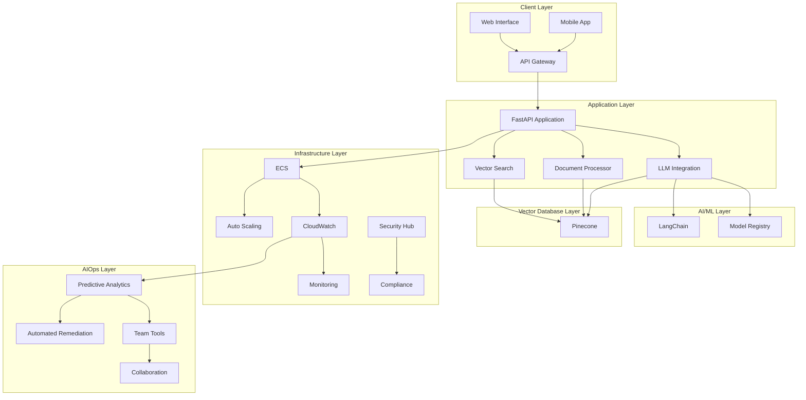
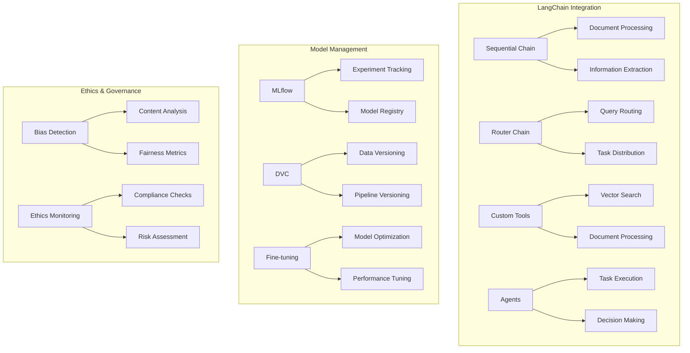
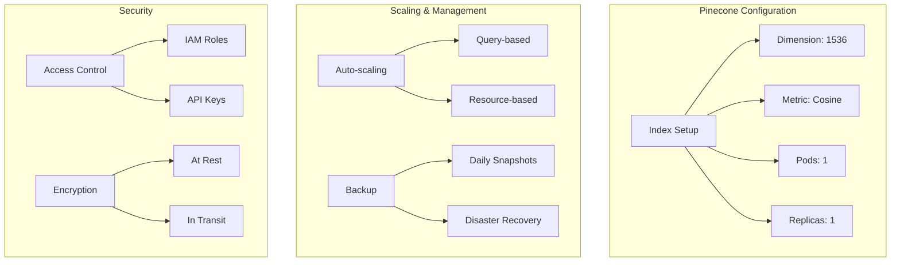
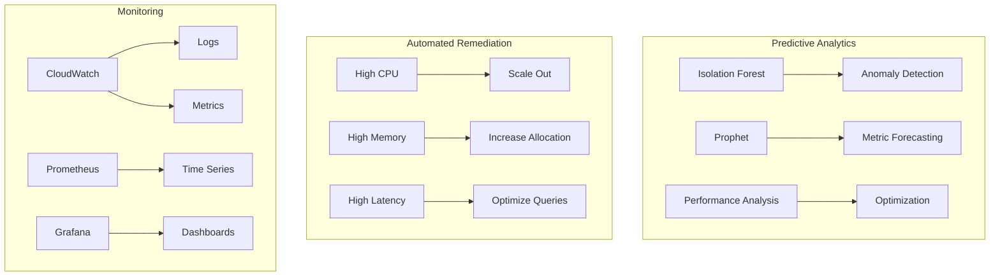
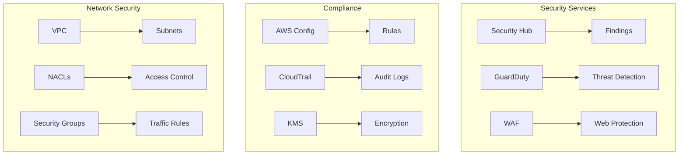
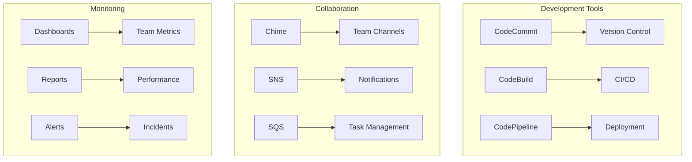

# DocuVector: AI-Powered Document Intelligence System

## Table of Contents
1. [Overview](#overview)
2. [Architecture](#architecture)
3. [System Components](#system-components)
   - [AI/ML Pipeline](#aiml-pipeline)
   - [Vector Database Integration](#vector-database-integration)
   - [AIOps and Monitoring](#aiops-and-monitoring)
   - [Security and Compliance](#security-and-compliance)
   - [Team Collaboration](#team-collaboration)
4. [Technologies Used](#technologies-used)
5. [Setup Instructions](#setup-instructions)
6. [Development Guide](#development-guide)
7. [Deployment](#deployment)
8. [Monitoring and Maintenance](#monitoring-and-maintenance)
9. [Contributing](#contributing)
10. [License](#license)

## Overview
DocuVector is an advanced document intelligence system that leverages Generative AI and Vector Databases to provide intelligent document processing, search, and analysis capabilities. The system is built with a focus on scalability, security, and operational excellence.

## Architecture

### High-Level Architecture

### Detailed Component Diagrams

#### AI/ML Pipeline

#### Vector Database Integration

#### AIOps and Monitoring

#### Security and Compliance

#### Team Collaboration

## System Components

### AI/ML Pipeline
- **LangChain Integration**: Advanced chains, custom tools, and agents
- **Model Management**: Versioning, tracking, and lifecycle management
- **Fine-tuning**: Custom model training and optimization
- **Bias Detection**: Ethical AI considerations and bias monitoring

### Vector Database Integration
- **Pinecone Configuration**: Optimized index setup and management
- **Scaling Policies**: Automatic scaling based on query patterns
- **Backup System**: Regular backups and disaster recovery
- **Security**: Access control and encryption

### AIOps and Monitoring
- **Predictive Analytics**: Anomaly detection and metric forecasting
- **Automated Remediation**: Self-healing capabilities
- **Performance Optimization**: Resource optimization recommendations
- **Dashboard**: Real-time monitoring and alerts

### Security and Compliance
- **AWS Security Hub**: Centralized security management
- **GuardDuty**: Threat detection
- **WAF**: Web application firewall
- **Compliance Monitoring**: Automated compliance checks

### Team Collaboration
- **Code Review**: Automated review workflows
- **Incident Response**: Team coordination and alerting
- **Metrics Dashboard**: Team performance tracking
- **Documentation**: Automated documentation generation

## Technologies Used
- **AI/ML**: LangChain, Bedrock, MLflow, DVC
- **Vector Databases**: Pinecone
- **Cloud Services**: AWS (ECS, S3, Lambda, SageMaker)
- **Monitoring**: CloudWatch, Prometheus, Grafana
- **CI/CD**: GitHub Actions, Terraform
- **Security**: AWS Security Hub, GuardDuty, WAF

## Setup Instructions
1. Clone the repository
2. Install dependencies: `pip install -r requirements.txt`
3. Configure AWS credentials
4. Set up MLflow tracking server
5. Initialize Pinecone
6. Deploy infrastructure: `terraform apply`

## Development Guide
1. Set up development environment
2. Follow coding standards
3. Write tests for new features
4. Use pre-commit hooks
5. Document changes

## Deployment
1. Run tests: `pytest`
2. Build containers: `docker build`
3. Deploy to ECS: `terraform apply`
4. Verify deployment
5. Monitor initial metrics

## Monitoring and Maintenance
1. Check CloudWatch dashboards
2. Review security findings
3. Monitor model performance
4. Update documentation
5. Perform regular backups

## Contributing
1. Fork the repository
2. Create feature branch
3. Submit pull request
4. Address review comments
5. Merge after approval

## License
MIT License

## Contact

For questions or support, please open an issue in the repository. 