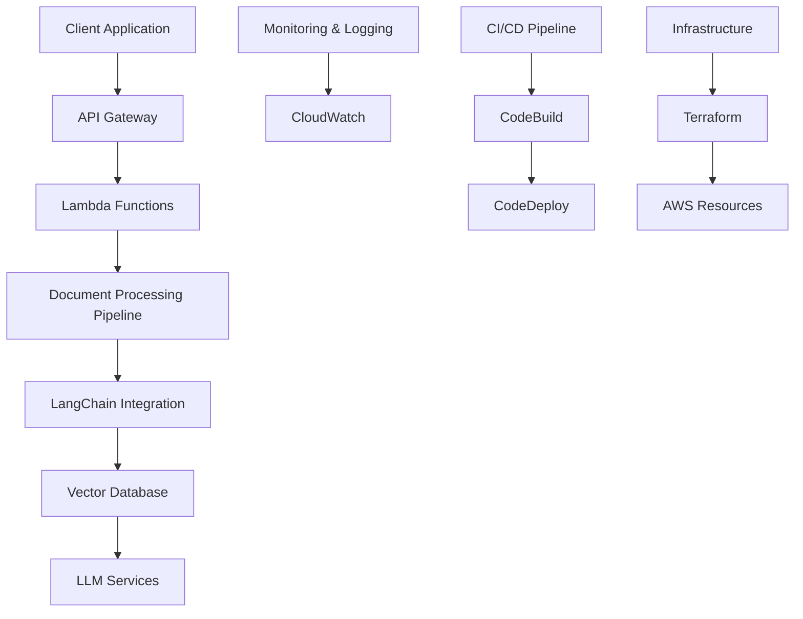

# DocuVector - AI-Powered Document Intelligence System

## Overview
DocuVector is a production-ready AI-powered document intelligence system that combines LangChain, Vector Databases, and AWS services. The system processes documents, extracts insights using LLMs, and provides intelligent search capabilities through vector embeddings.

## Architecture



### System Components

1. **Document Processing Pipeline**
   - AWS Lambda for serverless document processing
   - LangChain for document chunking and embedding
   - Vector Database (Pinecone) for semantic search

2. **AI/ML Integration**
   - LangChain for LLM orchestration
   - AWS SageMaker for model deployment
   - Custom ML models for document classification

3. **DevOps Infrastructure**
   - Infrastructure as Code (Terraform)
   - CI/CD Pipeline (AWS CodePipeline)
   - Container Orchestration (ECS)

4. **Monitoring & Observability**
   - CloudWatch for logging
   - Prometheus & Grafana for metrics
   - AIOps for anomaly detection

## Prerequisites

- AWS Account with appropriate permissions
- Python 3.9+
- Docker
- Terraform
- AWS CLI

## Setup Instructions

1. **Clone the Repository**
   ```bash
   git clone https://github.com/yourusername/docuvector.git
   cd docuvector
   ```

2. **Install Dependencies**
   ```bash
   pip install -r requirements.txt
   ```

3. **Configure AWS Credentials**
   ```bash
   aws configure
   ```

4. **Deploy Infrastructure**
   ```bash
   cd infrastructure
   terraform init
   terraform plan
   terraform apply
   ```

5. **Deploy Application**
   ```bash
   cd ..
   ./deploy.sh
   ```

## Project Structure

```
.
├── app/                    # Application code
│   ├── api/               # API endpoints
│   ├── processing/        # Document processing
│   └── models/            # ML models
├── infrastructure/        # Terraform configurations
├── monitoring/           # Monitoring setup
├── tests/               # Test suite
└── docs/                # Documentation
```

## Key Features

- Document processing and text extraction
- Semantic search using vector embeddings
- AI-powered document classification
- Automated CI/CD pipeline
- Infrastructure as Code
- Comprehensive monitoring and logging
- Scalable cloud architecture

## Technologies Used

- **AI/ML**: LangChain, OpenAI GPT, AWS SageMaker
- **Vector Database**: Pinecone
- **Cloud**: AWS (Lambda, S3, ECS, API Gateway)
- **DevOps**: Terraform, Docker, GitHub Actions
- **Monitoring**: CloudWatch, Prometheus, Grafana

## Contributing

1. Fork the repository
2. Create a feature branch
3. Commit your changes
4. Push to the branch
5. Create a Pull Request

## License

MIT License

## Contact

For questions or support, please open an issue in the repository. 